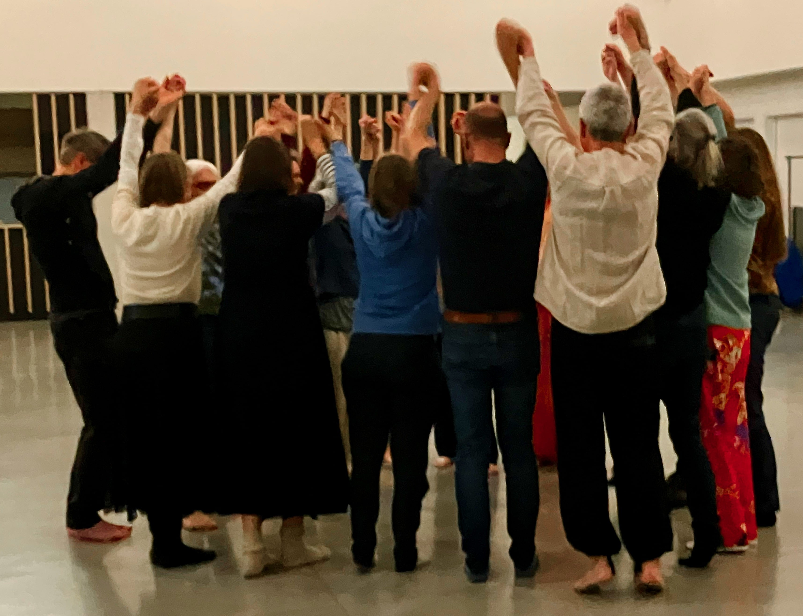

</br>

Lichaamstaal is even belangrijk en soms belangrijker dan gesproken taal.   
Het luisteren naar ons lichaam laat ook toe om ons bewust te worden van gevoelens en emoties, en ze te erkennen. 

<!--Onze lichaamshouding vertelt veel over ons levenspad. Door de gebeurtenissen, contacten, onze leefomgeving, de aandacht en liefde die we krijgen, gaat ons lichaam een bepaalde houding aannemen. Deze houding voelt vertrouwd aan. Sommige facetten in onze houding en lichaamstaal die ooit zijn ontstaan vanuit bescherming en toen zinvol waren, kunnen later onze groei, levensvreugde en omgeving (on)bewust beïnvloeden. Je meer bewust worden van je lichaamshouding kan er dan ook voor zorgen dat je zowel fysiek als emotioneel je plek kan innemen op een manier die goed voelt voor jou en anderen, dicht bij jezelf, in je midden.-->

Biodanza maakt gebruik van de kracht van muziek, dans en beweging in groep om tot een beleving (vivencia) te komen. Dat brengt positieve veranderingsprocessen op gang die door kunnen werken in ons dagdagelijkse leven. Jezelf en de ander ontmoeten staat in Biodanza centraal. Om tot een beleving te komen is het belangrijk dat we ons veilig voelen in de groep. We staan open voor elkaar zonder oordeel.

Biodanza is Gym voor je hele zijn en

- laat je opnieuw verbinden met jezelf, de anderen en het universum,
- het verbetert de algemene energie en stimuleert je organisme en cellen zich opnieuw te vernieuwen, 
- inspireert je om warmte en affectiviteit opnieuw in de wereld te zetten, en,
- laat je weer voeling krijgen met je oorspronkelijke manier van zijn.

Biodanza is een pad naar de vreugde van het leven.

Het systeem Biodanza werd gecreëerd door Rolando Toro Araneda uit Chili, voormalig hoogleraar expressie psychologie aan de Universiteit van Chili. Rolando Toro haalde inspiratie uit de antropologie en de gedragsbiologie. De theoretische achtergronden van Biodanza werd gevonden in de biologie: de wetenschap van het leven.

[Wekelijkse Groep Biodanza](./activiteiten.html)  

[Getuigenissen](./getuigenissen.html)

</br>

<center>
{width=50%}
</center>

<!--chapter:end:index.Rmd-->

---
title: "Fien & Lieven van Biodanza Brugge"
output:
    html_document:
        code_download: false
        toc: false
        number_sections: false
        code_folding: "none"
---

Biodanza Brugge is opgericht door Fien Morel en Lieven Clement met het oog om Biodanza mee de wereld in te zetten in Brugge.

### Fien Morel 
```{r echo=FALSE,out.width="40%",out.extra='style="float:left; padding:10px"'}
knitr::include_graphics("./figs/fien.jpeg")
```

Mijn eigen leef- en groeitraject is een grote bron van inspiratie in het begeleiden van mensen. Ik ben getrouwd met Lieven en mama van 3 kinderen die als waardevolle spiegel elke dag een grote inspiratie bron zijn.  

In 2018 kwam ik voor het eerst in contact met Biodanza. Sindsdien heeft het me niet meer losgelaten en voel ik de nood om dit mooie cadeau te delen. Ik volg de vier jarige Biodanza opleiding aan de [Biodanza school Antwerpen](https://www.biodanzaschoolantwerpen.be/). In mijn laatste jaar ben ik actief als Biodanza-docent-onder-supervisie van Annette Heynderickx en heb ik mijn eigen [wekelijkse Biodanza groep](./activiteiten.html) in Brugge.  

Dans en beweging zijn al van kindsbeen af aanwezig in mijn leven en dan ook niet meer weg te denken. Ik vind het heerlijk om mensen te begeleiden in het vinden van de dansende/bewegende stroom ‘in hun lichaam’. Ik ben al jaren bezig met lichaamswerk, dans, beweging en yoga. Ik gaf al zijnsdans in groep en crea-atelier aan kinderen. Ik volgde creatieve therapie bij VSPW/Balans met als optie dans- en bewegingstherapie en een 2 jarige opleiding lichaams-gecentreerde dynamische therapie bij TOUCHhelps. Een verrijking om via massage, beweging, lichaamslezen, ademhaling, spierspanning en -ontspanning … de weg naar lichaamsbewustzijn te laten groeien waardoor het algemeen welbevinden een boost krijgt en het inzicht duidelijker wordt.  

Ik geef les in BUSO Ravelijn en begeleid jongeren met een mentale beperking via Biodanza & Sherborne. Ik volgde de erkende Bach consulentenopleiding in De Walnoot in Brasschaat en werk als Bach consulent erkend door de Dr. Edward Bach Foundation Engeland in mijn praktijk [n-zicht](https://www.n-zicht.be). 

</br>

### Lieven Clement

```{r echo=FALSE,out.width="40%",out.extra='style="float:left; padding:10px"'}
knitr::include_graphics("./figs/lieven.jpg")
```

 Ik ben getrouwd met Fien, vader van 3 kinderen en werk als Professor in Statistische Genomica aan de [Universiteit Gent](https://www.ugent.be) waar ik de [statOmics](https://statomics.github.io/) groep leid. Mijn groep focust zich op de ontwikkeling van statistische methoden en open source tools voor differentiële transcriptomics en proteomics data analyse waarbij we respectievelijk genen en eiwitten wensen te vinden die anders tot expressie komen tussen groepen van planten, dieren of mensen (b.v. man $\leftrightarrow$ vrouw, ziek $\leftrightarrow$ gezond, en ook meer complexe vergelijkingen).  
 
Mijn leef- en groeitraject wordt gestuurd door mijn gezin, mijn passie voor wetenschappen en het lopen van de work-life balans.
Als gepassioneerde hoofdmens is het een uitdaging om geaard te blijven en ook mijn lichaam voeding te geven. En met Fien is Biodanza zomaar mijn leven binnengewandeld.  

Sinds 2018 neem ik deel aan een wekelijkse Biodanza groep en dat heeft me terug laten aankomen bij mezelf in het hier en nu. Het is een lab waarin ik mag oefenen in afstemmen, met mezelf, met de ander en met het groter geheel. Toen ik me wat meer in Biodanza ben gaan verdiepen, mocht ik ontdekken dat het een systeem is dat gestoeld is op een sterke wetenschappelijke basis. Het liet mijn passie voor het voelen, emoties, muziek en wetenschap voor het eerst samenkomen. Met Biodanza komen hoofd en hart helemaal samen. In 2021 ben ik dan ook met veel passie gestart met de Biodanza opleiding aan de [Biodanza school Antwerpen](https://www.biodanzaschoolantwerpen.be/). 


<!--chapter:end:about.Rmd-->

---
title: "Activiteiten van Biodanza Brugge"
output:
    html_document:
        code_download: false
        toc: false
        number_sections: false
        code_folding: "none"
---

<table>
<tr>
<td width=66%>

</td>
<td width=34%>

</td>
</table>

</br>
Biodanza is een pad naar de vreugde in het leven  
en maakt gebruik van de kracht van  
muziek, dans en beweging in groep  
om tot een beleving (vivencia) te komen.  

In de wekelijkse Biodanza groep dansen we en verbinden we met onszelf, de anderen en het groter geheel.   
We doen dat in een veilige groep waar we open staan voor elkaar zonder oordeel.

Voel je het verlangen om te dansen en te bewegen vanuit jouw krachtige, speelse, gevoelige, nood-aan-verbindende zijn? Warm welkom!

Enkele getuigenissen vind je [hier](getuigenissen.html)

</br>

<a name="activiteitenFienLieven"></a>

<!-- ### <span style="color:#AD441F">Nieuw!</span> Zomerlessen op maandag met Fien & Lieven 

Zin om verder te dansen tijdens de zomer? Dat kan! 

- Maandag 03/07, 10/07 en 17/07 van 19u30 tot $\pm$ 21u15 
- €15/les met 3 of 10 beurtenkaart
- [Klik hier om in te schrijven](./inschrijvenZomerLessen.html)

De lessen staan voor iedereen open. 
Is Biodanza nieuw voor jou? Welkom om deel te nemen met een 3-beurtenkaart en te beleven wat Biodanza jou kan brengen.
Heb je al Biodanza-ervaring dan kan je zoals anders je 10-beurten kaart gebruiken. 

</br>
-->

### Integratiegroep op maandag met Fien & Lieven 

Benieuwd om Biodanza te ervaren? Je hebt helemaal geen bewegingservaring nodig of een lichaam die (nog) alles kan. De bewegingen, dans en houdingen komen van binnenuit. Enkel een hart die zich wenst te openen is de sleutel tot de Biodanza ervaring.  

- Maandag van 19u30 tot $\pm$ 21u15
<!--
- Herfst 2024: 02/10, 09/10, 16/10, 23/10, 06/11, 13/11, 20/11, 27/11, 04/12, 11/12, 18/12
-->
- Voorjaar 2024: 08/01, 15/01, 22/01, 29/01, 05/02, 19/02, 26/02, 04/03, 11/03, 18/03
- €15/les met 3 of 10 beurtenkaart
- [Klik hier om in te schrijven](./inschrijvenIntegratieGroep.html)

</br>

<a name="activiteitenVirginie"></a>

### <span style="color:#AD441F">Nieuw!</span> Daggroep op dinsdag met Virginie 


- Dinsdag van 13u30 tot $\pm$ 15u30
<!-- 
- Ontdekkingsreeks (3 keer): 12/09, 19/09, 26/09 -- €40 
- Herfst 2023: 10/10, 17/10, 24/10, 7/11, 14/11, 21/11, 28/11, 05/12, 12/12, 19/12 
-->
- Voorjaar 2024:  09/01, 16/01, 23/01, 30/01, 6/02, 20/02, 27/02, 05/03, 12/03, 19/03 
- €15/les met 10 beurtenkaart 
- Ontdekkingreeks 3 opeenvolgende beurten €45

<!--
-->
- [Klik hier om in te schrijven](./inschrijvenVirginie.html)

</br>

### Verdiepingsgroep op woensdag met Fien & Lieven 

- Woensdag van 20u tot $\pm$ 21u45
<!-- 
- Herfst 2023: 13/09, 20/09, 27/09, 04/10, 11/10, 18/10, 25/10, 08/11, 15/11, 22/11, 29/11, 06/12, 13/12, 20/12
-->
- Voorjaar 2024: 10/01, 17/01, 24/01, 31/01, 07/02, 21/02, 28/02, 06/03, 13/03, 20/03, 27/03
- €15/les met 3 of 10 beurtenkaart
- Inschrijven na contact met Fien  ([info@n-zicht.be](mailto:info@n-zicht.be) of +32 486 52 41 56)

</br>

### Deelnemen

  - Virginie 
    - Ontdekkingsreeks -- 3 opeenvolgende lessen -- €45 
    - 10-beurtenkaart -- €150: geldig bij Virginie 

</br> 

  - Fien & Lieven 
    - 10-beurtenkaart -- €150: geldig voor lessen in alle reeksen bij Fien & Lieven
    - 3-beurtenkaart -- €45: 3 opeenvolgende lessen bij Fien & Lieven
    - Instromen in de verdiepingsgroep kan als je al ervaring hebt met Biodanza. Neem je dan eerst even contact op met Fien? [info@n-zicht.be](mailto:info@n-zicht.be) of +32 486 52 41 56

</br>

### Waar? 

Centrum Xaverianen (Fien & Lieven),  
Polyvalente zaal A  
Xaverianenstraat 3,  
8200 Sint-Michiels

</br>

Co-housing Eikenberg (Virginie)    
Eikenberg 27/A         
8310 Sint-Kruis

</br> 

### Wanneer? 

- Integratiegroep: maandag van 19u30u tot $\pm$ 21u15 (Fien & Lieven).

- Daggroep: dinsdag van 13u30 tot $\pm$ 15u30 (Virginie). 
- Verdiepingsgroep: woensdag van 20u tot $\pm$ 21u45 (Fien & Lieven).

</br>

### Wat heb je nodig? 

  - Een dekentje,
  - een flesje water, en
  - kledij waar je vrij in kan bewegen
  
</br>

### Inschrijven 

<!-- 
- Zomerlessen op maandag (Fien & Lieven): [klik hier om in te schrijven](./inschrijvenZomerLessen.html)
-->
- Integratiegroep op maandag (Fien & Lieven): [klik hier om in te schrijven](./inschrijvenIntegratieGroep.html)
- Daggroep op dinsdag (Virginie): [klik hier om in te schrijven](./inschrijvenVirginie.html)
- Verdiepingsgroep op woensdag (Fien & Lieven): na contact met Fien  ([info@n-zicht.be](mailto:info@n-zicht.be) of +32 486 52 41 56)


<!--chapter:end:activiteiten.Rmd-->

---
title: "Biodanza & Wetenschap"
output:
    html_document:
        code_download: false
        toc: false
        number_sections: false
        code_folding: "none"
---


```{r echo=FALSE,out.width="45%",out.extra='style="float:left; padding:10px"'}
knitr::include_graphics("https://www.labarcaotroteatro.com/wp-content/uploads/2019/07/primeros-pasos-rolando-toro-post.jpg")
```

Voor Rolando Toro, de grondlegger van de Biodanza, was het allerbelangrijkste in de Biodanza: "Vivencia, Vivencia, Vivencia". Dus Beleving, Beleving en Beleving en dat door middel van dans, muziek en  beweging in groep van waaruit je een intieme verbondenheid kan voelen met jezelf, de ander, en het groter geheel. Om zo tijdens Biodanza te ervaren dat het leven één is, en, dat zonder het te hoeven bedenken.   

Rolando was ook een gepassioneerd wetenschapper en professor in de psychologie. Hij ontwikkelde Biodanza vanuit zijn persoonlijke ervaringen en realiseerde zich al vroeg dat zijn systeem zijn fundament heeft in de wetenschappen die het leven bestuderen. 

</br>

```{r echo=FALSE,out.width="25%",out.extra='style="float:right; padding:10px"'}
knitr::include_graphics("./figs/Prochlorococcus_marinus.jpg")
```

Hij ente Biodanza op het biocentrische principe waarbij je niet langer de mens maar alle het leven centraal zet. Hij haalde ondermeer zijn inspiratie hiervoor bij twee Belgische Nobelprijswinnaars:  

Ilya Prigogine die de theorie ontwikkelde die aantoont dat de chemie van het leven orde uit chaos kan laten ontstaan, en  

Christian de Duve die het leven even eenvoudig als geniaal definieerde: "het leven is één, chemie en informatie" en die vandaar uit zijn beroemde citaat formuleerde  "Life is an obligatory manifestation of matter, written into the fabric of the universe". 

</br>

Interesse om je helemaal onder te dompelen in de wetenschappelijke fundamenten van de Biodanza? 

Dan delen we graag het monografie van Lieven naar aanleiding van de theorie die hij verzorgde voor Weekend 4, 15/01/2022-16/01/2022, in de Biodanza opleiding Antwerpen: [Biologische Aspecten van Biodanza](https://biodanzabrugge.be/biologischeAspectenBiodanza/) 


<!--chapter:end:biodanzaEnWetenschap.Rmd-->

---
title: "Biological Aspects of Biodanza, Guest Lecture in Biodanza Teacher Training Antwerp"
author: "Lieven Clement"
date: "[Biodanza Brugge](https://biodanzabrugge.be) & [statOmics](https://statomics.github.io)"
output:
    html_document:
      code_download: true
      toc: true
      toc_float: true
      highlight: tango
      number_sections: true
---

<a rel="license" href="https://creativecommons.org/licenses/by-nc-sa/4.0"></a>

Slides for Weekend 4 "Biologische Aspects of Biodanza", 15/01/2022-16/01/2022, in [Biodanza Teacher Training Antwerpen](https://www.biodanzaschoolantwerpen.be/biodanza-opleiding)


Dutch version with youtube clips: on [biodanzabrugge.be](https://biodanzabrugge.be/biologischeAspectenBiodanza.html). 


</br>


# Biocentric Principle 

The biocentric principle is at the heart of Rolando Torro’s system of Biodanza. 

The universe is 

- the matrix of life
- a self-organising structure that is building life
- can be considered to be living organism, itself. 

$\rightarrow$ Invites people to radically rethink their relationship with the entire biosphere.

$\rightarrow$ life itself is intrinsically sacred, which probes us to put all living beings, or life itself, at the heart of our weltanschauung. 

</br>  

## Vivencia

- the unique path to experience the biocentric principle and to genuinely become aware of it. 
- This not through our mind, but, through that deeper knowledge that lies hidden in our inner self.
  
</br>  

## Inspiration from 3 Nobel price Laureates

- Erwin Schrödinger: "order-from-disorder" 
- Ilia Prigogine: "Dissipative structures" 
- Christian de Duve: "Life is an obligatory manifestation of matter, written into the fabric of the universe"

</br>  

# Biological Aspects of Biodanza

{width=50%}
</center>

1. Principes of cosmic life and genesis of life 
2. Evolution en fylogenesis
3. Ontogenesis  
  
</br>  

# What is Life?


## Schrödinger en Prigogine

Book: "What Is Life? The Physical Aspect of the Living Cell" (Schrödinger, 1944). 

Life is 

1. een open system that can generate order from chaos by exploiting external energy sources (entropy is disorder),

2. with the capacity to transmit its own specific blueprint from generation to generation (reproductive invariance). 

Note, that DNA was not known yet when Schrödinger wrote his seminal book. 


</br>  

### How is this possible

- Second law of thermodynamics: a closed system is always gearing towards maximal entropy

- Entropy is a measure for disorder 

<center>{width=30%} $\rightarrow$ {width=30%}
</center>

</br>

- Life is 
    
    - based on chemical reactions
    - an open system
    - solar energie 
    - chaos of molecule on earth  
    - While chemical reactions produce structure a lot of energy is lost into heat: dissipation. 
      
      $\rightarrow$ Increase of entropy

</br>

Prigogine did research to chemical systems far from equilibrium. 

- Open systems: influx of mater en energy 

- Reactions consist of many feedback loops  

- They can generate structure: e.g chemical clocks, spatial and spatio-temporal waves in concentration of chemicals 

- They dissipate incoming energy while producing structure

- He called them dissipative structures. 

</br>

Our solar system is a dissipative zone where order can originate from chaos. 

- Life produces entropy by dissipating energy from fotons (light and UV) to heat through organic pigments (e.g. chlorophyll)   

- This heat induces secondairy dissipative processes like the water cycle, wind and sea currents etc. 

- So life also transforms its environment.

</br>  

## Definition according to de Duve


Book: "Life Evolving - Molecules, Mind and Meaning" (de Duve, 2002)

Life is 

1. one
2. chemistry
3. information 

</br>  

Origin of leven:

- first energy
- then chemistry and
- subsequently information

</br>  

### Life is one


#### All organism consist of cells

- unicellular organisms

{width=50%}  
(Cyanobacterium, source: Chisholm Lab, wikipedia) 

</br>  

- Essential: membrane that is separating them from there environment and enables interaction with the environment 

</br>  

- Multicellular organisms 

  
(source: mrssmithsbiology)

</br>  

#### LUCA (last Universal Common Ancestor).

- All cells orginate from the same population of ancestral cells  


(Source: wikipedia)    

</br>  
    
#### Universal fuel for life (is actually chemistry)


(Source: adapted from wikipedia)

- ATP: Adinose-tri-phosphate
- Note that AMP is one of the building blocks of RNA. 
- Link between energy and information! 

</br>  

#### Same building blocks for all living organisms 

1. Lipids: membranes
2. Carbohydrates (sugars): energy + building blocks
3. Amino acids: building blocks of proteins, which are the workhorses of a cell 
4. Nucleic Acids: building blocks of RNA and DNA

</br>  

##### Lipids 

(Source: Doug Hatfield, wikipedia)

</br>  

##### Carbohydrates 

(Source: thebiologynotes.com)

</br>  

##### Amino Acids

(Source: thebiologynotes.com)

</br>  
    
##### Nucleic Acids

- Building blocks for the molecules that store the information that we inherit form our parents: RNA and DNA


{width=50%}  
(RNA, Source: wikipedia)

</br>  

  
(DNA, Source: OpenStax, wikipedia)

</br>  

  
(Source: Sponk, wikipedia)

</br>  
    

#### Same genetic code (See Life is information)

</br>  

### Life is Chemistry

[](http://biochemical-pathways.com/#/map/1)
(Source: Dr. Gerhard Michal, Roche)
<!-- 
Not working http in https
<div style="position:relative;padding-top:56.25%;">
<iframe src= "http://googleweblight.com/?liteurl=https://biochemical-pathways.com/#/map/1" frameborder="0" allowfullscreen
      style="position:absolute;top:0;left:0;width:100%;height:100%;">
</iframe>
</div> -->

#### Energy 


(Source: wikipedia)

</br>  

#### Catalysis


(Source: Narayanese, wikipedia)

</br>  
<div style="position: relative;width: 100%;height: 0;padding-bottom: 56.25%;">
<iframe
src="https://www.youtube.com/embed/yk14dOOvwMk?start=8&end=60"
frameborder="0"
style=" position:absolute;top: 0;left: 0;width: 100%;height: 100%;"
allow="autoplay; encrypted-media" allowfullscreen data-external="1" start=8></iframe>
</div>
</br>  

"Any living organism is a reflection of its enzyme arsenal" 
 
- Catalysis: a large number of chemical reactions would never happen when we only would mix molecules without a catalist. 

- Catalist: chemical substance that helps a reaction to take place without being consumed itself.

- Biological catalists are referred to as enzymes  

- Enzymes are proteins that  
  
  - are fishing certain molecules from the complex mixture in a cell, 
  - which consists of thousands of chemical compounds 
  - generally at low concentrations;
  - through bindingsites they can facilitate that these molecules (substrates) are getting close so that they can react and form a new compound. 
</br>  

#### Self-organisation

- Some proteins also give structure to a cel 
- The can spontaneously form structrue 
- See video where cytoplasm ("liquid in cell") was homogenised and is subsequently organising itself in cell-like structures. 
</br>  
<div style="position: relative;width: 100%;height: 0;padding-bottom: 56.25%;">
<iframe
src="https://www.youtube.com/embed/prq1Occu22s?start=0&end=7&loop=1"
frameborder="0"
style=" position:absolute;top: 0;left: 0;width: 100%;height: 100%;"
allow="autoplay; encrypted-media" allowfullscreen data-external="1" start=8></iframe>
</div>

(Source: Science DOI: 10.1126/science.aav7793)

</br>  

Researcher found that the following was required for this: 

- ATP: the energy source of a cell 
- a filamentous proteines (microtubuli) 
- Dynein, a kind of motor protein

  
(Source: Pakorn Kanchanawong, wikipedia)

</br>  

Protein plays a central role in life: Catalysis + structure 

A cell thus inherits not only genetic information but also its spatial organisation from a mother cell. 

</br>  

### Life is information

</br>  
<div style="position: relative;width: 100%;height: 0;padding-bottom: 56.25%;">
<iframe
src="https://www.youtube.com/embed/ult4_6hh5zo"
frameborder="0"
style=" position:absolute;top: 0;left: 0;width: 100%;height: 100%;"
allow="autoplay; encrypted-media" allowfullscreen data-external="1" start=8></iframe>
</div>
</br> 

- Gene: unit of genetic material, a DNA sequence that is encoding for the synthesis of a gene product, a protein or a functional RNA. 


(Source: Thomas Shafee, wikipedia)

</br>

- DNA: 4 letter code (4 basen: ACGT)
- RNA: 4 letter code (4 basen: ACGU)

{width=50%}  
(Source: Sponk, wikipedia)

</br>  

  
(Source: [tokresources.org](http://www.tokresource.org/tok_classes/biobiobio/biomenu/transcription_translation/))

</br>  

- Principle: hybridisation of complementary bases! 
- Transport RNA: codon (triplet van 3 basen) for each nucleic acid that is transported
</br>  

- Protein: chain of amino acids 

    - there exist more than  400 amino acids
    - only 20 were selected by life to build proteins. 

{width=50%}  
(Source: wikipedia)

</br>  

- Code is evolved so that many mutations give rise to 

  - synonymous codons (same amino acid) or
  - to incorporate amino acids that are similar  
  $\rightarrow$ protein function is conserved 

</br>  

- DNA is the carier of genetic material (cfr. hard drive)

- RNA plays a more central role: 

    - Messenger RNA (cfr RAM memory)
    - Ribozymen: catalitic function
        - transfer RNA for translation of proteins 
        - in ribosomes for translatie of proteins 
        - a lot of other rybozymes (catalic RNA)
    - RNA primer essential to copy  DNA   
    - Carrier of genetic material (e.g. corona virus)

</br>  

# Principles of cosmic life and the genesis of life

## Intro {-}
<center>
{width=50%}
</center>
</br>  

## Genesis of universe


  
(Source: NASA/WMAP Science Team, wikipedia) 

</br>  

## Genesis of the first stars

- Cooling of expanding universe
- Gaseous Clouds essentially consisting of hydrogen (H) and helium (He)

  
(Source: universe-review.ca)

</br>  

- Concentration difference in cloud 

$\rightarrow$ Gravity lets the cloud further contract  

$\rightarrow$ Implosion of cloud 

$\rightarrow$ star formation: Extreme heating in imploded  nebula by gravity 

$\rightarrow$ condition that give rise to nuclear fusion

$\rightarrow$ convert light atoms to heavy atoms and release of lots of energy 
</br>  

## Nuclear fusion

{width=50%}  
(Source: Sarang, wikipedia)

</br>  

- If all hydrogen is used, formation of heavier atoms during supernova (explosion of star) 
</br>  

  
(Source: www.universetoday.com)

</br>  

- Nuclear fusion in star until iron

  
(Source: Fastfission, wikipedia)

</br>  

- All heavier atoms has been built in stars $\rightarrow$ we are built from cosmic dust! 

- Upon supernova there is a new nebula that can give rise to new stars 
</br>  

## Carbohydrates in interstellar space

- Poly aromatic carbohydrates  (PAHs) in interstellar space

    - Cat's paw nebula
    - Green regions are regions where the radiation of hot stars induces fluorescence of PAHs. 
    
{width=200%}  
(Source: NASA/JPL-Caltech, wikipedia)

</br>  

- PAHs were generated short after the Big Bang. 


- They are further transformed in interstellar space

    - hydrogenation: hydrogen, 
    - oxidation: oxigen, 
    - hydroxylation (OH) 
    - ...

$\rightarrow$ first step to amino acids (building blocks of proteins) and nucleotides (building blocks of RNA and DNA). 

</br>  

## Genesis of the solar system and of life 

</br>  
<div style="position: relative;width: 100%;height: 0;padding-bottom: 56.25%;">
<iframe
src="https://www.youtube.com/embed/j5wB4Cm5E8Q"
frameborder="0"
style=" position:absolute;top: 0;left: 0;width: 100%;height: 100%;"
allow="autoplay; encrypted-media" allowfullscreen data-external="1" start=8></iframe>
</div>
</br> 


  
(Author: Matthew Twombly)

</br>  

Upon cooling of the earth water is formed: 

{width=50%}  
(Source: wikipedia)

</br>  

- Peculiar molecule: liquid at rather high temperatures due to hydrogen bridges
- Liquid water is essential for life
- Solidifies(freezes) with volume increase! (lowest volume at 4°C)

</br>  

RNA

- Note that RNA consists of AMP, CMP, GMP en UMP 
- Biological energy "coin": ATP same molecule but with 3 phosphate groups (see ATP/ADP)
- RNA has been shown to be catalytic and can replicate itself under anoxic conditions and in the presence of iron (e.g. Williams et al, Nat.Chem., 2013, DOI: 10.1038/nchem.1649)

</br>  

# Evolution and phylogenesis


## Intro {-}

<center>
{width=50%}  
</center>

</br>


</br>


(Source: wikipedia)    

</br>  

## Evolution

### Variability and selection

Bacteria & Archae  
{width=70%}  
(Source: Ecoddington, wikipedia)

Eukaryota

(Source: Ali Zifan, wikipedia)

</br>  

<center>
{width=40%}  
(Source: wikipedia)
</center>

</br> 

- Error margin of DNA  replication: 1 error per billion basepairs that are copied (Human genome 6.4 billion basepairs)  

- Insertions/deletions: basepairs that are added or removed  

- Recombination: reshuffling of genetic traits, e.g. during sexual reproduction (e.g. recombination of paternal and maternal segments during meiosis).
$\rightarrow$ Mutations
$\rightarrow$ Natural variability

- Most mutaties are neutral $\rightarrow$ Moleculair/Genetic clock
- But not always

</br>  


{width=45%}
{width=45%}  
(Source: Thomas Samuel (1), OpenStax College (2), BruceBlaus(3), wikipedia)

</br>  

- Many in Africa 
- Why does this mutation remains? 
- Selection by ecofactors: malaria resistence 

</br>  


### Evolution


- Natural process that forms the basis of the origin of species (plants, animals, bacteria, fungi, ... and homonids)

- Driven by two opposing forces: **variation** en **selection**

- Variation by spontaneous copy errors in genetic code:  mutations

- Selection upon ecofactors, is mutation beneficial or harmfull for a particular organism in its specific environment.

- Odds on fixation of mutation depends on reproductive success

- Process of mutation and selection can eventually lead to new species upon many generations. 
</br>  


### Genetic drift 


- Genetic drift: randpm fluctuations of allelles  

- Particularly strong in small populations

- As opposed to selection it is not adaptive. 

- New species will originate more quickly when a small fraction of the population gets isolated in a new environment. 

</br>  


### Horizontal gene transfer 
- Non sexual transfer of genetic information 

- Very common between prokaryotes (eubacteria and arachae bacteria) 

  - e.g. exchange of antibiotics resistance. 

- between eukaryotes (mainly in protists, unicellular organisms with nucleus)  

- between prokaryotes (eubacteria and arachae bacteria) and eukaryotes (protisten, fungae, plants and animals)

</br>  

### Teleonomy

- There is only the primitive goal to maintain and reproduce the species. 

- Evolution has no purpose or direction 

- When complex organs and organisms originate its seems as if there is a direction/purpose but that is not the case. 

</br>  

{width=50%}  
(Source: Matticus78, wikipedia)

</br>  

- The eye is not developed by evolution with the purpose to see. 

- The eye only has the function to see

- It is the result of a gradual process where each adaptation gave a reproductive advantage in a particular environment. 

- In another environment it can be nolonger functional and than it might dissapear, e.g. moles eye 
    
- The origin of a species is the result of evolution but not the purpose of evolution. 

- evolution is adaptation with as goal maintance and reproduction 

</br>  

#### Evolution has no direction

- Distribution of number of species and complexity

  
(Source: Stephen J. Gould, 1996, Full House: the spread of Excellence from Plato To Darwin)  
  
- Distribution of carbon mass fixated in different types of species. 

  
(Massa in giga ton koolstof. Source: doi.org/10.1073/pnas.1711842115)

</br>  

- Note, large error margin on bacteria (can be a factor 10 larger). 

- Number of bacterial cells in our body (Source: doi.org/10.1371/journal.pbio.1002533): 
  - \#bacterial cells/\#human cells earlier estimated as $\pm$ 10/1 
  - recent estimatiom  $\pm$ 1/1. 
  - Human of 70kg $\pm$ 38 trillion bacterial cells/30 trillion humane cells (trillion: 1000 billion: 10$^12$!).


</br>  

## Phylogenese 

Origin of all species by evolution

  
(Source: wikipedia)    

- Rolando refers to origin of species and adaptation to the environment as evolutionary differentiation. 

</br>  

### Timescale


| 4.5 BYA | 4.3 BYA | 3.8 BYA | 3.5 BYA | 540 MYA | 520 MYA |
|---------|---------|---------|---------|---------|---------|
|         |         |         |         |         |         |

(Source: naturedocumetaries.org)


- Black Earth (4.5 BYA): hot basalt rock and dust in a cold vacuum

- Grey Earth (4.3 BYA): granite

- Blue Earth (3.8 BYA): water

- Red Earth (3.5 BYA): Radical change due to life. 

    - Cyanobacteria $\rightarrow$ fotosynthesis $\rightarrow$ oxygen
    - All iron in the ocean precipitates as iron oxide (rust, red) 
    - 250 $\rightarrow$ > 5000 minerals. 
    - Mass extinction
  
  
- White Earth (540 MYA)
    - Large ice age
    - Mass extinction
    - Volcanic activity comes to the rescue: greenhouse gasses 
  
  
- Green Earth (520 MYA)
    
    - Explosion of life 
    - fron unicellular to more complex life.  

</br>  

### Changepoint: Genesis of eukaryotic cell

Tww archetypes: prokaryoten (simple cells,  0.1 to 5.0 $\mu m$) and eukaryotes (larger and more complex cells, 10-100 $\mu m$) 

{width=30%}
{width=30%}
{width=30%}  
(Source:  Ali Zifan (1) & Mariana Ruiz Villarreal (2 & 3), wikipedia) 

</br>  

- 3.5 BYA - 520 MYA only prokaryote cells in fossils

</br>  


Genesis of Eukaryotic cell by endosymbiosis:

  
(Source: Kelvinsong, wikipedia)

</br>  

- Prokaryotes: reproduction by cell devision, mutation fixed in all daugther cells. 

</br>  

- Eukaryotes: nearly all have a phase of sexual reproduction
  
  - much more variation: recombination of chromosomes
  - diploid organisms have two copies of each gene (father and mother) $\rightarrow$ successive mutations in 1 copy possible in the presence of another functional copy of the gene. 
  
</br>  
  
- Eukaryotes evolve further in 

  - protists (unicellular)
  - fungae
  - plants
  - animals

</br>  

Genetic information of a species can be seen as a record of the environments and development that it underwent up to this point 

</br>  

## Evolution of evolution

1. Chemical evolution: selection of building blocks and complex chemistry
2. Biological evolution: cell/organism $\rightarrow$ selection genetic information and function
3. Cultural evolution can bypass natural evolution:
    
    - artificial selection: breeding of plants, pets, cattle, genetic manipulation, etc.
    - Technology: fast adaptation to new environment

</br>  
    
# Ontogenesis
## Intro {-}


</br>
<center>
{width=50%}
</center>

</br>  

- Ontogenesis: development of organism from fertilized egg cell to adult individual until death 

- Each cell (except egg and sperm cell) of multi-cellular organism has same genetic material!


- Why are cells of same organism so morphologically diverse? 

</br>

## Epigenetics

  
(Source: NIH, wikipedia)

</br>

  
(Source: Mariuswalter, wikipedia)

</br>  

- Differentiation $\rightarrow$ epigenetics

- Epigenetics: epigenetic markers on DNA and histones $\rightarrow$ gene cam be transcribed or not. 

- Epigenetics is driven by ecofactors. 

- identical twins have almost the same genome (small differences have been build up in the womb), but it gets more easy to tell them apart over time: epigenetics


</br> 

<center>
{width=50%}
</center>
(Difference due to eco-factor UV-exposure, Source: Swab & Hogenson, DOI: 10.1007/978-3-319-31143-2_65-1)

</br> 

  
(Source doi: 10.1111/j.1526-4637.2012.01488.x)

</br>  

- Epigenetics is very important in development of the brain and for learning. 

- Wiring of the brain: 

    - Hereditary
    - Random
    - Ecofactors select and amplify connections
    - Connections that are not used disappear
    - Communication (trough all senses) is key in development of child brain

</br>  

## Ontogenesis in Biodanza

</br>  
<div style="position: relative;width: 100%;height: 0;padding-bottom: 56.25%;">
<iframe
src="https://www.youtube.com/embed/b7jQT-qtG2g"
frameborder="0"
style=" position:absolute;top: 0;left: 0;width: 100%;height: 100%;"
allow="autoplay; encrypted-media" allowfullscreen data-external="1" start=8></iframe>
</div>
</br> 


</br>
<center>
{width=50%}
</center>

- Ontogenesis is the vertical axis and can be seen time axis in model!

- Vivencia has a strong impact on the brain
$\rightarrow$ sensations that we experience are the genes that encode for a diverse scala of hormones and neurotransmitters that are being expressed. 

- Long lasting practice of  Biodanza can induce epigenetic changes and thus how we can use our genetic potential. 

- Our tool? 
  
  - Regression and identity in the five lines of Biodanza. 
  - Pulsation between regression and identity is essential because an organism tends to filter stimuli that are continuously present! 
  
  
- It has been shown that mind-body methods (meditation, qigong, tai chi, yoga) can induce cell rejuvenation by the activation of the gene that encodes for teleomerase (The telomere effect, Nobel Price Winner Elizabeth Blackburn and Elissa Epel)

</br>  

# Closing remarks 

- Life is
    - one
    - chemistry 
    - information 

</br>  

- Cosmic life 

    - Atoms of life originated in the stars 

    - In the dust of the stars the essential molecules and building blocks of life have been built, which are omnipresent in the cosmos. 
    
    - Under the right conditions these building blocks structured them spontaneously in life as we know it. 
    
    - First there was energy, then chemistry and finaly information: together they are life
    
    - In quantum mechanics  and theory of relativity matter is nolonger seen as passive and inert    
        
        - but as a form of energy
        - with a dynamic nature
        - on atomic and subatomic scale there is a lot of void with a continuous dance and pulsation of electrons, protons, neurons, atoms and molecules
    
    - Dualism (matter, sole) $\rightarrow$ monoism (matter)  
    
    - "Life is an obligatory manifestation of matter, written into the fabric of the universe" (Christian de Duve)


</br>  
  
- Organisms and life cannot be studied without considering there intimate relation to their environment/ecosystem

    - molecules do not work alone but in large networks
    - environmental conditions are important for self organisation
    - selective evolution: selection by eco-factors 
    - organisms adapt/shape in turn their environment and eco-factor: e.g. cyanobacteria
    - individual evolution: eco-factors $\leftrightarrow$ epigenetics 
    - eco-factors are also determined by other organisms: eco-system
    - Organisms interact and collaborate in their ecosystem
    - Genetic information can be considered as the record of all conditions in which our ancestral cells have lived.   
      
      $\rightarrow$ "Web of Life" 

</br>

- With Biodanza we can affect the ontogenesis or  
- how our genes are used in our cells! 

</br>

<center>
{width=50%}
</center>

<!--chapter:end:biologicalAspectsOfBiodanza2021.Rmd-->

---
title: "Biologische Aspecten van Biodanza, Gastles in Biodanza Opleiding Antwerpen"
author: "Lieven Clement"
date: "[Biodanza Brugge](https://biodanzabrugge.be) & [statOmics](https://statomics.github.io)"
output:
    html_document:
      code_download: true
      toc: true
      toc_float: true
      highlight: tango
      number_sections: true
---

<a rel="license" href="https://creativecommons.org/licenses/by-nc-sa/4.0"></a>

Slides voor Weekend 4 "Biologische Aspecten van Biodanza", 15/01/2022-16/01/2022, in de [Biodanza opleiding Antwerpen](https://www.biodanzaschoolantwerpen.be/biodanza-opleiding)

Totale duur van het lesmateriaal: ongeveer 2 uur 10 min.

**Volledige Youtube Playlist (19 clips, totale afspeeltijd 129min)**. De clips zijn ook afzonderlijk te bekijken bij elk onderdeel. 

<div style="position: relative;width: 100%;height: 0;padding-bottom: 56.25%;">
<iframe 
src="https://www.youtube.com/embed/videoseries?list=PLKAFO-HAp2GzJISIKlDHtXZc573RLn1PG" style=" position:absolute;top: 0;left: 0;width: 100%;height: 100%;"
title="YouTube video player" frameborder="0" allow="accelerometer; autoplay; clipboard-write; encrypted-media; gyroscope; picture-in-picture" allowfullscreen></iframe>
</div>

</br>


# Introductie door Annette Heynderickx {-}
<div style="position: relative;width: 100%;height: 0;padding-bottom: 56.25%;">
<iframe
src="https://www.youtube.com/embed/JV1IMKtAdZQ"
frameborder="0"
style=" position:absolute;top: 0;left: 0;width: 100%;height: 100%;"
allow="autoplay; encrypted-media" allowfullscreen data-external="1" start=8></iframe>
</div>
</br> 

# Biocentrisch Principe 
<div style="position: relative;width: 100%;height: 0;padding-bottom: 56.25%;">
<iframe
src="https://www.youtube.com/embed/TRuBtMwTYX4"
frameborder="0"
style=" position:absolute;top: 0;left: 0;width: 100%;height: 100%;"
allow="autoplay; encrypted-media" allowfullscreen data-external="1" start=8></iframe>
</div>
</br> 

De theorie van Biodanza heeft Rolando geënt op zijn axioma: ‘biocentrisch principe’. 

Het universum is
        
- Matrix van het leven 
- Zelforganiserende structuur die leven opbouwt 
- Opgevat als levend organisme
 

$\rightarrow$ Uitnodiging om je relatie als menselijk wezen tot de hele biosfeer grondig te herdenken  

$\rightarrow$ Leven is intrensiek sacraal en hoort dus in het hart te liggen van levensbeschouwing/wereldbeeld  

</br>  

## Vivencia

- Unieke weg om het biocentrisch principe te beleven en om ervan doordrongen te worden.
- En dat niet door onze mind maar door een dieper innerlijk weten
  
</br>  

## Inspiratie bij 3 Nobelprijs Winnaars

- Erwin Schrödinger: "order-from-disorder" 
- Ilia Prigogine: "Dissipatieve structuren" 
- Christian de Duve: "Life is an obligatory manifestation of matter, written into the fabric of the universe"

</br>  

# Biologische Aspecten van de Biodanza

<div style="position: relative;width: 100%;height: 0;padding-bottom: 56.25%;">
<iframe
src="https://www.youtube.com/embed/S0BJOsAwXdI"
frameborder="0"
style=" position:absolute;top: 0;left: 0;width: 100%;height: 100%;"
allow="autoplay; encrypted-media" allowfullscreen data-external="1" start=8></iframe>
</div>
</br>
</br>
<center>
{width=50%}
</center>

1. Principes van het kosmische leven en genese van het leven
2. Evolutie en fylogenese
3. Ontogenese  
  
</br>  

# Wat is Leven?

**Youtube Playlist (5 clips, totale afspeeltijd 45 min)**. De clips zijn ook afzonderlijk te bekijken bij elk onderdeel.
<div style="position: relative;width: 100%;height: 0;padding-bottom: 56.25%;">
<iframe 
src="https://www.youtube.com/embed/videoseries?list=PLKAFO-HAp2GwX7OTx4HmMVz1__wfnbl2W" style=" position:absolute;top: 0;left: 0;width: 100%;height: 100%;"
title="YouTube video player" frameborder="0" allow="accelerometer; autoplay; clipboard-write; encrypted-media; gyroscope; picture-in-picture" allowfullscreen></iframe>
</div>
</br>


## Schrödinger en Prigogine
<div style="position: relative;width: 100%;height: 0;padding-bottom: 56.25%;">
<iframe
src="https://www.youtube.com/embed/M6L_e3M1H4E"
frameborder="0"
style=" position:absolute;top: 0;left: 0;width: 100%;height: 100%;"
allow="autoplay; encrypted-media" allowfullscreen data-external="1" start=8></iframe>
</div>
</br> 

Boek: "What Is Life? The Physical Aspect of the Living Cell" (Schrödinger, 1944). 

Het leven is 

1. een open systeem dat orde kan creeëren uit chaos door externe energie bronnen uit te buiten: negatieve entropie (entropie is wanorde),

2. met de capaciteit om zijn eigen specifieke blauwdruk door te geven van generatie op generatie (reproductieve invariantie). 

Merk op dat DNA in de tijd van Schrödinger nog niet is gekend.


</br>  

### Hoe kan dit? 

- Tweede hoofdwet van de thermodynamica: een gesloten systeem streeft steeds naar maximale entropie

- Entropie is graad wanorde

<center>{width=30%} $\rightarrow$ {width=30%}
</center>

</br>

- Leven is 
    
    - gebaseerd op chemische reacties
    - een open systeem
    - energie van de zon 
    - chaos van moleculen op aarde 
    - Tijdens de chemische reacties die structuur geven wordt ook veel energie verloren in warmte: dissipatie  
      
      $\rightarrow$ Toename van entropie

</br>

Prigogine onderzocht chemische systemen ver uit thermodynamisch evenwicht  

- Open systemen: influx van materie en energie  

- De reacties bevatten typisch veel feedback loops  

- Ze kunnen zelf structuur genereren: chemische klokken, spatiale en spatiotemporale concentratie golven  

- Ze dissiperen hiervoor de inkomende energie  

- Hij noemde ze dissipatieve structuren  

</br>

Ons zonnestelsel is een dissipatieve zone waar orde uit chaos kan worden gegenereerd.  

- Het leven doet aan entropie productie door de energie in UV en zichtbare fotonen te dissiperen in warmte door organische pigmenten (vb. chlorofyl).  

- Deze hitte induceert secundaire dissipatieve processen zoals de water cyclus, wind en zeestromingen, orkanen, enz.

</br>  

## Definitie volgens de Duve

</br>  
<div style="position: relative;width: 100%;height: 0;padding-bottom: 56.25%;">
<iframe
src="https://www.youtube.com/embed/eBhxjndX0J0"
frameborder="0"
style=" position:absolute;top: 0;left: 0;width: 100%;height: 100%;"
allow="autoplay; encrypted-media" allowfullscreen data-external="1" start=8></iframe>
</div>
</br> 

</br>

Boek: "Life Evolving - Molecules, Mind and Meaning" (de Duve, 2002)

Het Leven is 

1. één
2. chemie
3. informatie 

</br>  

Ontstaan van leven:

- eerst energie
- vervolgens chemie en 
- daarna informatie 

</br>  

### Het leven is één

</br>  
<div style="position: relative;width: 100%;height: 0;padding-bottom: 56.25%;">
<iframe
src="https://www.youtube.com/embed/B2xk4SLGoF8"
frameborder="0"
style=" position:absolute;top: 0;left: 0;width: 100%;height: 100%;"
allow="autoplay; encrypted-media" allowfullscreen data-external="1" start=8></iframe>
</div>
</br> 

#### Alle organismen zijn opgebouwd uit cellen

- Eencelligen

{width=50%}  
(Cyanobacterium, bron: Chisholm Lab, wikipedia) 

</br>  

- Essentieel is dat ze een membraan hebben die hen afscheid van de omgeving en interactie met omgeving mogelijk maakt. 

</br>  

- Meercelligen 

  
(bron: pmgbiology)

</br>  

#### LUCA (last Universal Common Ancestor).

- Alle cellen komen voort uit een gemeenschappelijke populatie voorouderlijke cellen.  


(Bron: wikipedia)    

</br>  
    
#### Universele brandstof voor leven (is eigenlijk geen verbranding maar chemie)


(bron: adapted from wikipedia)

- ATP: Adinose-tri-phosphate
- Merk op dat AMP een van de bouwblokken is van RNA 
- Link tussen energie en informatie! 

</br>  

#### Zelfde bouwblokken voor alle levende organismen

1. Lipiden (vetachtige substanties): membranen afscheiding
2. Koolhydraten (suikers): energie + bouwblok
3. Aminozuren: basisbouwblokken van eiwitten de werkpaarden van een cel
4. Nucleine-zuren: basisbouwblokken van RNA en DNA

</br>  

##### Lipiden    

(bron: Doug Hatfield, wikipedia)

</br>  

##### Koolhydraten 

(bron: thebiologynotes.com)

</br>  

##### Aminozuren

(bron: thebiologynotes.com)

</br>  
    
##### Nucleïne zuren

- Bouwblokken voor dragers van erfelijk materiaal RNA en DNA


{width=50%}  
(RNA, bron: wikipedia)

</br>  

  
(DNA, bron: OpenStax, wikipedia)

</br>  

  
(bron: Sponk, wikipedia)

</br>  
    

#### Zelfde genetische code (zie Het Leven is Informatie)

</br>  

### Het Leven is Chemie

</br>  
<div style="position: relative;width: 100%;height: 0;padding-bottom: 56.25%;">
<iframe
src="https://www.youtube.com/embed/zv_l-3Wrx1I"
frameborder="0"
style=" position:absolute;top: 0;left: 0;width: 100%;height: 100%;"
allow="autoplay; encrypted-media" allowfullscreen data-external="1" start=8></iframe>
</div>
</br> 


[](http://biochemical-pathways.com/#/map/1)
(bron: Dr. Gerhard Michal, Roche)
<!-- 
Not working http in https
<div style="position:relative;padding-top:56.25%;">
<iframe src= "http://googleweblight.com/?liteurl=https://biochemical-pathways.com/#/map/1" frameborder="0" allowfullscreen
      style="position:absolute;top:0;left:0;width:100%;height:100%;">
</iframe>
</div> -->

#### Energie 


(bron: wikipedia)

</br>  

#### Katalyse


(bron: Narayanese, wikipedia)

</br>  
<div style="position: relative;width: 100%;height: 0;padding-bottom: 56.25%;">
<iframe
src="https://www.youtube.com/embed/yk14dOOvwMk?start=8&end=60"
frameborder="0"
style=" position:absolute;top: 0;left: 0;width: 100%;height: 100%;"
allow="autoplay; encrypted-media" allowfullscreen data-external="1" start=8></iframe>
</div>
</br>  

"Any living organism is a reflection of its enzyme arsenal" 
 
- Katalyse: Groot aantal chemische reacties die nooit zouden gebeuren wanneer we de molecules gewoon zouden mengen zonder een katalysator

- Katalysator: een chemische verbinding die de reactie help plaatsvinden zonder hierbij te worden verbruikt. 

- Biologische katalysatoren worden enzymes genoemd. 

- Enzymes zijn eiwitten die 
  
  - de bepaalde molecules vissen uit het complex mengsel van de cel, 
  - dat uit duizenden verbindingen bestaan,
  - en dat meestal met een lage concentratie;
  - d.m.v. bindingssites die deze moleculen (ook substraten genoemd) samenbrengen in 3D zodat deze kunnen reageren en een nieuwe verbinding kunnen vormen. 

</br>  

#### Zelforganisatie 

- Sommige eiwitten geven ook structuur aan de cel
- Ze kunnen zich spontaan zelf organiseren
- Zie video waarbij cytoplasma (celsap) werd gehomogeniseerd dat zich daarna spontaan herorganiseerd in celachtige structuren.

</br>  
<div style="position: relative;width: 100%;height: 0;padding-bottom: 56.25%;">
<iframe
src="https://www.youtube.com/embed/prq1Occu22s?start=0&end=7&loop=1"
frameborder="0"
style=" position:absolute;top: 0;left: 0;width: 100%;height: 100%;"
allow="autoplay; encrypted-media" allowfullscreen data-external="1" start=8></iframe>
</div>

(bron: Science DOI: 10.1126/science.aav7793)

</br>  

De onderzoekers vonden dat volgende nodig was hiervoor: 

- ATP de energiebron van een cel 
- soort filamenteuze proteinen (microtubuli) 
- Dynein, een soort motor proteine 

  
(bron: Pakorn Kanchanawong, wikipedia)

</br>  

Proteinen spelen dus een centrale rol in het leven: katalyse + structuur

Een cel erft van de moedercel niet alleen erfelijk materiaal maar ook spatiale organisatie door haar bestaande macro-moleculaire componenten.

</br>  

### Het Leven is informatie

</br>  
<div style="position: relative;width: 100%;height: 0;padding-bottom: 56.25%;">
<iframe
src="https://www.youtube.com/embed/ult4_6hh5zo"
frameborder="0"
style=" position:absolute;top: 0;left: 0;width: 100%;height: 100%;"
allow="autoplay; encrypted-media" allowfullscreen data-external="1" start=8></iframe>
</div>
</br> 

- Gen: basiseenheid van erfelijk materiaal, een DNA sequentie die codeert voor de synthese van een gen product, een eiwit of een functioneel RNA. 


(bron: Thomas Shafee, wikipedia)

</br>

- DNA: 4 letter code (4 basen: ACGT)
- RNA: 4 letter code (4 basen: ACGU)

{width=50%}  
(bron: Sponk, wikipedia)

</br>  

  
(bron: [tokresources.org](http://www.tokresource.org/tok_classes/biobiobio/biomenu/transcription_translation/))

</br>  

- Principe: hybridisatie van complementaire basen! 
- Transport RNA: codon (triplet van 3 basen) per aminozuur die wordt aangebracht

</br>  

- Eiwit: keten opgebouwd uit aminozuren 

    - er bestaan meer dan 400 aminozuren 
    - enkel 20 werden geselecteerd door het leven om eiwitten te bouwen

{width=50%}  
(bron: wikipedia)

</br>  

- Code is zo geëvolueerd dat veel mutaties leiden tot 

  - synonieme codons (zelfde aminozuur) of 
  - tot inbouwen van aminozuur dat niet erg sterk verschillend is 
  $\rightarrow$ eiwit functie blijft behouden


</br>  

- DNA is enkel de drager van ergelijk materiaal (te vergelijken met harde schijf)

- RNA speelt een meer centrale rol:

    - Messenger RNA (te vergelijken met werkgeheugen van een cel)
    - Ribozymen: katalitische functie 
        - transfer RNA bij translatie tot eiwitten
        - in ribosomen bij translatie tot eiwitten 
        - nog vele andere rybozymen
    - RNA primer noodzakelijk voor kopieren van DNA   
    - Drager van erfelijk materiaal (vb corona virus)

</br>  

# Principes van het Kosmische Leven en Genese van het Leven

**Youtube Playlist (2 clips, totale afspeeltijd 19 min)**. De clips zijn ook afzonderlijk te bekijken bij elk onderdeel.
<div style="position: relative;width: 100%;height: 0;padding-bottom: 56.25%;">
<iframe 
src="https://www.youtube.com/embed/videoseries?list=PLKAFO-HAp2GwssL7aGq0mlAaWd7GOadHC" style=" position:absolute;top: 0;left: 0;width: 100%;height: 100%;"
title="YouTube video player" frameborder="0" allow="accelerometer; autoplay; clipboard-write; encrypted-media; gyroscope; picture-in-picture" allowfullscreen></iframe>
</div>
</br>

## Intro {-}
<center>
{width=50%}
</center>
</br>  

## Ontstaan van het heelal

</br>  
<div style="position: relative;width: 100%;height: 0;padding-bottom: 56.25%;">
<iframe
src="https://www.youtube.com/embed/-IYF8QR8oks"
frameborder="0"
style=" position:absolute;top: 0;left: 0;width: 100%;height: 100%;"
allow="autoplay; encrypted-media" allowfullscreen data-external="1" start=8></iframe>
</div>
</br> 

  
(bron: NASA/WMAP Science Team, wikipedia) 

</br>  

## Ontstaan van eerste sterren

- Na afkoelen van expanderende heelal
- Gaswolken die vooral bestaan uit waterstof (H) en helium (He)

  
(bron: universe-review.ca)

</br>  

- Concentratie verschillen in de wolk 

$\rightarrow$ zwaartekracht trekt wolk verder samen  

$\rightarrow$ implosie van wolken  

$\rightarrow$ stervorming: grote opwarming in middenste van geimplodeerde nevel door zwaartekracht  

$\rightarrow$ condities waardoor kern fusie mogelijk wordt   

$\rightarrow$ omzetten van lichte atomen naar zwaardere atomen waarbij heel veel energie vrijkomt 

</br>  

## Kernfusie

{width=50%}  
(bron: Sarang, wikipedia)

</br>  

- Als alle waterstof opgebruikt is, vorming van zwaardere atomen veelal tijdens supernova (ontploffing van de ster)

</br>  

  
(bron: www.universetoday.com)

</br>  

- Kernfusie in sterren tot ijzer 

  
(bron: Fastfission, wikipedia)

</br>  

- Alle zwaardere atomen zijn gemaakt in de sterren $\rightarrow$ we zijn opgebouwd uit kosmische stof! 

- Na supernova is er opnieuw een nevel waaruit weer nieuwe sterren kunnen ontstaan. 

</br>  

## Koolstofverbindingen in interstellaire ruimte

- Poly aromatische koolstof verbindingen (PAHs) in de interstellaire ruimte

    - Cat's paw nebula in melkweg.
    - Groene regio's zijn gebieden waarin straling van hete sterren PAHs doet fluoresceren. 
    
{width=200%}  
(bron: NASA/JPL-Caltech, wikipedia)

</br>  

- PAHs werder al kort na de Big Bang gegenereerd. 


- Worden in interstellaire ruimte verder getransformeerd 

    - hydrogenatie: waterstoffen, 
    - oxidatie: zuurstof, 
    - hydroxylatie (OH) 
    - ...

$\rightarrow$ eerste stap naar aminozuren (bouwblokken eiwitten) en nucleotiden (bouwblokken RNA en DNA). 

</br>  

## Ontstaan van het zonnestelsel en de genese van het leven

</br>  
<div style="position: relative;width: 100%;height: 0;padding-bottom: 56.25%;">
<iframe
src="https://www.youtube.com/embed/j5wB4Cm5E8Q"
frameborder="0"
style=" position:absolute;top: 0;left: 0;width: 100%;height: 100%;"
allow="autoplay; encrypted-media" allowfullscreen data-external="1" start=8></iframe>
</div>
</br> 


  
(Author: Matthew Twombly)

</br>  

Na afkoeling van de aarde is er water: 

{width=50%}  
(bron: wikipedia)

</br>  

- Merkwaardige molecule: vloeibaar bij vrij lage temperaturen door waterstof bruggen 
- Vloeibaar water essentieel voor leven
- Stolt met volume vergroting! 

</br>  

RNA

- Merk op dat RNA bestaat uit AMP, CMP, GMP en UMP 
- Biologische energie "coin": ATP zelfde molecule maar met 3 fosfaatgroepen (zie ATP/ADP)
- Recent onderzoek toont aan dat RNA ook bijzonder katalytisch is en zichzelf kan repliceren in condities zonder zuurstof en in aanwezigheid van ijze (e.g. Williams et al, Nat.Chem., 2013, DOI: 10.1038/nchem.1649)

</br>  

# Evolutie en Fylogenese

**Youtube Playlist (7 clips, totale afspeeltijd 37 min)**. De clips zijn ook afzonderlijk te bekijken bij elk onderdeel.
<div style="position: relative;width: 100%;height: 0;padding-bottom: 56.25%;">
<iframe 
src="https://www.youtube.com/embed/videoseries?list=PLKAFO-HAp2GyTVop8DsC57uhvWgIwZ8Ag" style=" position:absolute;top: 0;left: 0;width: 100%;height: 100%;"
title="YouTube video player" frameborder="0" allow="accelerometer; autoplay; clipboard-write; encrypted-media; gyroscope; picture-in-picture" allowfullscreen></iframe>
</div>
</br>

## Intro {-}
<div style="position: relative;width: 100%;height: 0;padding-bottom: 56.25%;">
<iframe
src="https://www.youtube.com/embed/TDK2hSAEm80"
frameborder="0"
style=" position:absolute;top: 0;left: 0;width: 100%;height: 100%;"
allow="autoplay; encrypted-media" allowfullscreen data-external="1" start=8></iframe>
</div>
</br> 

<center>
{width=50%}  
</center>

</br>


</br>


(Bron: wikipedia)    

</br>  

## Evolutie

### Variatie en Selectie

</br>  
<div style="position: relative;width: 100%;height: 0;padding-bottom: 56.25%;">
<iframe
src="https://www.youtube.com/embed/9SYX6ASaWAQ"
frameborder="0"
style=" position:absolute;top: 0;left: 0;width: 100%;height: 100%;"
allow="autoplay; encrypted-media" allowfullscreen data-external="1" start=8></iframe>
</div>
</br> 

Bacteria & Archae  
{width=70%}  
(bron: Ecoddington, wikipedia)

Eukaryota

(Bron: Ali Zifan, wikipedia)

</br>  

<center>
{width=40%}  
(bron: wikipedia)
</center>

</br> 

- Foutenmarge bij DNA  replicatie: 1 fout per miljard baseparen die wordt gekopieerd (Menselijk genoom 6.4 miljard baseparen)  

- Inserties/deleties: baseparen die worden toegevoegd of verwijderd  

- Recombinatie: herschikking van genetische eigenschappen, bijvoorbeeld bij geslachtelijke voortplanting (andere combinatie van genen dan beide ouders)
$\rightarrow$ Mutaties  
$\rightarrow$ Natuurlijke variabiliteit

- Meeste mutaties zijn veelal neutraal  $\rightarrow$ Moleculaire/Genetische Klok
- Maar soms ook niet

</br>  


{width=45%}
{width=45%}  
(Bron: Thomas Samuel (1), OpenStax College (2), BruceBlaus(3), wikipedia)

</br>  

- Komt vooral in Afrika voor.
- Waarom blijft deze mutatie bestaan? 
- Selectie door ecofactoren: omdat het resistentie geeft tegen malaria 

</br>  


### Evolutie 

</br>  
<div style="position: relative;width: 100%;height: 0;padding-bottom: 56.25%;">
<iframe
src="https://www.youtube.com/embed/kWx-zyFdC0c"
frameborder="0"
style=" position:absolute;top: 0;left: 0;width: 100%;height: 100%;"
allow="autoplay; encrypted-media" allowfullscreen data-external="1" start=8></iframe>
</div>
</br> 


- Natuurlijk proces dat aan de basis ligt van het ontstaan van alle soorten (planten, dieren, bacteriën, schimmels, ... en mensachtigen)

- Eindresultaat van twee tegenwerkende krachten: **variatie** en **selectie**

- Variatie door spontaan optreden van foutjes in de genetische code: mutaties

- Selectie door combinatie van omgevingsomstandigheden en mutatie, is mutatie gunstig of schadelijk is voor bepaald organisme in deze omgeving

- Kans dat een mutatie wordt overgedragen, afhankelijk van voortplantingssucces

- Proces van mutatie en selectie kan over veel generaties leiden tot nieuwe soort

</br>  


### Genetische drift 

</br>  
<div style="position: relative;width: 100%;height: 0;padding-bottom: 56.25%;">
<iframe
src="https://www.youtube.com/embed/CTuMi9aYs8A"
frameborder="0"
style=" position:absolute;top: 0;left: 0;width: 100%;height: 100%;"
allow="autoplay; encrypted-media" allowfullscreen data-external="1" start=8></iframe>
</div>
</br> 

- Genetische drift: toevallige fluctuatie van allelen 

- Vooral sterk in kleine populaties

- In tegenstelling tot selectie niet adaptief 

- Ontstaan van nieuwe soort gaat sneller als een klein deel van de populatie wordt afgesplitst in een nieuw milieu. 

</br>  


### Horizontale genuitwisseling

</br>  
<div style="position: relative;width: 100%;height: 0;padding-bottom: 56.25%;">
<iframe
src="https://www.youtube.com/embed/X-Oc33ZWNQo"
frameborder="0"
style=" position:absolute;top: 0;left: 0;width: 100%;height: 100%;"
allow="autoplay; encrypted-media" allowfullscreen data-external="1" start=8></iframe>
</div>
</br> 
- Niet sexuele uitwisseling van genetische informatie

- Veelvuldig tussen prokaryoten (eubacteria en arachae bacteria) 

  - vb uitwisseling resistentie tegen antibiotica

- tussen eukaryoten (vooral protisten, eencellige organismen met celkern)  

- tussen prokaryoten (eubacteria en arachae bacteria) en eukaryoten (protisten, planten en dieren)

</br>  

### Teleonomie

</br>  
<div style="position: relative;width: 100%;height: 0;padding-bottom: 56.25%;">
<iframe
src="https://www.youtube.com/embed/BR2K8Wy1XPA"
frameborder="0"
style=" position:absolute;top: 0;left: 0;width: 100%;height: 100%;"
allow="autoplay; encrypted-media" allowfullscreen data-external="1" start=8></iframe>
</div>
</br> 

- Er is enkel het unieke primitieve doel van behoud en reproductie van de soort.

- Evolutie heeft verder geen doel of richting 

- Bij het ontstaan van complexe organen en organismen kan het lijken alsof er een richting is/alsof die met een doel zijn ontstaan, maar dat is er niet. 

</br>  

{width=50%}  
(bron: Matticus78, wikipedia)

</br>  

- Een oog is niet door de evolutie ontwikkeld met het doel om te zien. 

- Het oog heeft enkel de functie om te zien

- Het is het resultaat van een gradueel proces waarbij elke aanpassing weer reproductief voordeel gaf in dat bepaald milieu. 

- In een andere omgeving kan het niet langer nuttig zijn, bv mol en verdwijnt de functie weer
    
- Het ontstaan van een soort is het resultaat van evolutie, maar niet het doel van evolutie. 

- evolutie: is aanpassing met als doel behoud en reproductie

</br>  

#### Evolutie heeft geen richting

- Verdeling van aantal species en complexiteit

  
(bron: Stephen J. Gould, 1996, Full House: the spread of Excellence from Plato To Darwin)  
  
- Verdeling van massa koolstof die vastligt in verschillende types organismen 

  
(Massa in giga ton koolstof. Bron: doi.org/10.1073/pnas.1711842115)

</br>  

- Wel heel grote foutenmarge op bacteriën (kan factor 10 hoger zijn). 

- Aantal bacteriële cellen in ons lichaam (bron: doi.org/10.1371/journal.pbio.1002533): 
  - \#bacteriële cellen/\#menselijke cellen vroeger geschat op$\pm$ 10/1 
  - recente schatting $\pm$ 1/1. 
  - Mens van 70kg $\pm$ 38 biljoen bacteriële cellen/30 biljoen humane cellen (biljoen: 1000 miljard).


</br>  

## Fylogenese 

</br>  
<div style="position: relative;width: 100%;height: 0;padding-bottom: 56.25%;">
<iframe
src="https://www.youtube.com/embed/VwHbj1MhxNY"
frameborder="0"
style=" position:absolute;top: 0;left: 0;width: 100%;height: 100%;"
allow="autoplay; encrypted-media" allowfullscreen data-external="1" start=8></iframe>
</div>
</br> 

Ontstaan van alle soorten door evolutie

  
(Bron: wikipedia)    

- Het ontstaan van soorten en aanpassing aan het milieu noemt Rolando ook evolutionaire differentiatie. 

</br>  

### Tijdschaal


| 4.5 BYA | 4.3 BYA | 3.8 BYA | 3.5 BYA | 540 MYA | 520 MYA |
|---------|---------|---------|---------|---------|---------|
|         |         |         |         |         |         |

(bron: naturedocumetaries.org)


- Black Earth (4.5 BYA): heet basalt gesteente en stof in koud vacuum

- Grey Earth (4.3 BYA): graniet

- Blue Earth (3.8 BYA): water

- Red Earth (3.5 BYA): Radicale verandering door leven. 

    - Cyanobacteria die fotosynthese doen. 
    - Zuurstof. 
    - Alle ijzer in oceaan precipiteert als roest (rood). 
    - Van 250 $\rightarrow$ > 5000 mineralen. 
    - Massale uitsterfte van leven. 
  
  
- White Earth (540 MYA)
    - Grote ijstijd
    - Massale uitsterfte van leven
    - Vulcanische activiteit was redding: broeikasgassen
  
  
- Green Earth (520 MYA)
    
    - Explosie leven 
    - Van eencellig naar meer complex leven 

</br>  

### Kantelpunt: Genese van eukaryote cel

Twee archetypes: prokaryoten (eenvoudige cellen,  0.1 to 5.0 $\mu m$) en eukaryoten (grotere meer complexe cellen, 10-100 $\mu m$) 

{width=30%}
{width=30%}
{width=30%}  
(bron:  Ali Zifan (1) & Mariana Ruiz Villarreal (2 & 3), wikipedia) 

</br>  

- 3.5 BYA - 520 MYA enkel prokaryote cellen teruggevonden in fosielen

</br>  


Genese van Eukaryote cel door endosymbiosis:

  
(bron: Kelvinsong, wikipedia)

</br>  

- Prokaryoten: reproductie door celdeling, mutatie gefixeerd in alle dochtercellen 

</br>  

- Eukaryoten: bijnal allemaal een fase met sexuele reproductie
  
  - veel meer variatie: recombinatie van chromosomen 
  - bij diploide organismen zijn er twee kopieën van elk gen (vader en moeder) $\rightarrow$ opeenvolgende mutaties van 1 kopie mogelijk terwijl nog een andere functionele kopie is van het gen. 

</br>  
  
- Eukaryote cellen evolueren verder in 

  - protisten (eencelligen)
  - planten
  - dieren

</br>  

Genetische informatie van een soort kan ook worden gezien als een soort "logboek" van de milieus en ontwikkeling die ze heeft ondergaan tot dit punt. 

</br>  

## Evolutie van evolutie

1. Chemische evolutie: selectie van bouwblokken en complexe chemie
2. Biologische evolutie: cel/organisme $\rightarrow$ selectie genetische informatie and functie 
3. Culturele evolutie die natuurlijke evolutie soms bypassed: 
    
    - artificiële selectie: plantenveredeling, huisdieren/vee, genetische manipulatie, ...
    - Technologie: snelle aanpassing aan nieuw milieu, adaptatie van milieu 

</br>  
    
# Ontogenese

**Youtube Playlist (2 clips, totale afspeeltijd 20 min)**. De clips zijn ook afzonderlijk te bekijken bij elk onderdeel.
<div style="position: relative;width: 100%;height: 0;padding-bottom: 56.25%;">
<iframe 
src="https://www.youtube.com/embed/videoseries?list=PLKAFO-HAp2GysTNvKUNIJiqrPa8J6zZW0" style=" position:absolute;top: 0;left: 0;width: 100%;height: 100%;"
title="YouTube video player" frameborder="0" allow="accelerometer; autoplay; clipboard-write; encrypted-media; gyroscope; picture-in-picture" allowfullscreen></iframe>
</div>
</br>

## Intro {-}
<div style="position: relative;width: 100%;height: 0;padding-bottom: 56.25%;">
<iframe
src="https://www.youtube.com/embed/iuor4m6wOGY"
frameborder="0"
style=" position:absolute;top: 0;left: 0;width: 100%;height: 100%;"
allow="autoplay; encrypted-media" allowfullscreen data-external="1" start=8></iframe>
</div>
</br> 

</br>
<center>
{width=50%}
</center>

</br>  

- Ontogenese: ontwikkeling van een organisme van eicel tot overlijden van volwassen individu. 

- Elke cel van meercellig organisme bevat zelfde erfelijk materiaal!


- Waarom zijn cellen van zelfde organisme nu zo verschillend?

</br>

## Epigenetica 

  
(bron: NIH, wikipedia)

</br>

  
(bron: Mariuswalter, wikipedia)

</br>  

- Differentiatie $\rightarrow$ epigenetica 

- Epigenetica: epigenetische merkers op DNA en histonen $\rightarrow$ gen kan worden afgelezen of niet.

- Epigenetica wordt beïnvoeld door ecofactoren. 

- Eeneiige tweelingen zelfde genoom, verschillen steeds meer gedurende het leven: epigenetica


</br> 

<center>
{width=50%}
</center>
(Verschil door ecofactor UV-blootstelling, bron: Swab & Hogenson, DOI: 10.1007/978-3-319-31143-2_65-1)

</br> 

  
(Bron doi: 10.1111/j.1526-4637.2012.01488.x)

</br>  

- Epigenetica heel belangrijk bij ontwikkeling van het brein en leren

- Wiring of the brain: 

    - Erfelijk
    - Random
    - Ecofactoren selecteren en amplificeren verbindingen
    - Verbindingen die niet worden gebruikt verdwijnen
    - Communicatie (via alle zintuigen) is key bij ontwikkeling van kinderbrein

</br>  

## Ontogenese in Biodanza

</br>  
<div style="position: relative;width: 100%;height: 0;padding-bottom: 56.25%;">
<iframe
src="https://www.youtube.com/embed/b7jQT-qtG2g"
frameborder="0"
style=" position:absolute;top: 0;left: 0;width: 100%;height: 100%;"
allow="autoplay; encrypted-media" allowfullscreen data-external="1" start=8></iframe>
</div>
</br> 


</br>
<center>
{width=50%}
</center>

- Ontogenese kan worden gezien als de tijdsas in het model!

- Vivencia werkt sterk in op brein
$\rightarrow$ de sensaties die we hierbij ervaren zijn afkomstig van de genen van allerlei hormonen en neurotransmitters die tot expressie worden gebracht. 

- Langdurig beoefenenen van Biodanza kan epigenetica beïnvloeden en dus hoe genetisch potentieel wordt benut.

- Onze tool? 
  
  - Regressie en identiteit in de 5 lijnen 
  - de pulsatie tussen regressie en identiteit is nodig want een organisme filtert prikkels weg die continu zijn!  
  
  
- Aangetoond dat mind-body technieken (meditatie, qigong, tai chi, yoga) celverjonging kunnen induceren door activatie van het gen dat codeert voor teleomerase (The telomere effect (Jonger worden), Nobelprijs winnares Elizabeth Blackburn en Elissa Epel)

</br>  

# Slotopmerkingen 

- Het leven is
    - één
    - chemie 
    - informatie 

</br>  

- Het kosmische leven 

    - In de sterren ontstonden de atomen van het leven 
    
    - In het stof van de sterren werden deze omgezet tot essentiële moleculen en bouwblokken van het leven die alom aanwezig in de kosmos
    
    - Onder de juiste condities structureren deze bouwblokken zich spontaan tot leven zoals we dat kennen 
    
    - Eerst was er energie, toen kwam chemie en daarna informatie: samen zijn ze het leven
    
    - Vanuit de quantum mechanica en relativiteitstheorie zien we materie niet langer passief of inert maar          
        
        - als een vorm van energie 
        - met een dynamische natuur
        - op atomaire schaal en subatomaire schaal is er heel veel leegte waarin er een continue dans en pulserende beweging is van electronen, protonen, neutronen, atomen en moleculen 
    
    - Dualisme (materie, ziel) $\rightarrow$ monoisme (materie)  
    
    - Het leven is een obligate manifestatie van materie die is geschreven in het weefsel van de kosmos (Christian de Duve)


</br>  
  
- Organismen en leven kan niet worden bestudeerd los van hun intieme relatie met hun milieu/ecosysteem

    - moleculen werken niet alleen maar in grote netwerken
    - omgevingscondities zijn belangrijk voor zelforganisatie
    - selectieve evolutie: selectie door ecofactoren 
    - organismen veranderen/shapen ook op hun beurt het milieu en ecofactoren: denk maar aan de cyanobacteriën 
    - individuele evolutie: ecofactoren $\leftrightarrow$ epigenetica 
    - ecofactoren worden ook bepaald door andere organismen: ecosysteem
    - Organismen interageren en werken samen in het ecosysteem
    - Genetische informatie kan als het ware worden gezien als "logboek" van alle condities waarin onze voorouderlijke cellen hebben geleefd.  
      
      $\rightarrow$ "Web of Life" 

</br>

- Met Biodanza kunnen we de ontogenese beïnvloeden of 
- Hoe onze genen worden gebruikt in onze cellen!

</br>

<center>
{width=50%}
</center>

<!--chapter:end:biologischeAspectenBiodanza2021.Rmd-->

---
title: "Contact met Biodanza Brugge"
output:
    html_document:
        code_download: false
        toc: false
        number_sections: false
        code_folding: "none"
---

### Fien Morel

<table>
<tr>
<td width=30% style="vertical-align: top;"></td> 
<td width=5%></td>
<td style="vertical-align: top;">Biodanza docent onder supervisie van Annette Heynderickx  
Erkend Bach Bloesem Consulent en Lichaamsgericht Therapeut  
Veldstraat 39, 8200 Sint-Michiels (Brugge)  
GSM: +32 486 52 41 56  
mail: [info@n-zicht.be](mailto:info@n-zicht.be)
</td>
</tr>
</table>

</br> 

### Virginie Reina

<table>
<tr>
<td width=30% style="vertical-align: top;"></td> 
<td width=5%></td>
<td style="vertical-align: top;">Biodanza docent onder supervisie van Ricardo Toro  
  
GSM: +32 475 86 52 14           
mail: [virginie.reina@gmail.com](mailto:virginie.reina@gmail.com)
</td>
</tr>
</table>

</br> 

### Lieven Clement 

<table>
<tr>
<td width=30% style="vertical-align: top;"></td> 
<td width=5%></td>
<td style="vertical-align: top;">
Professor of Statistical Genomics  
Veldstraat 39, 8200 Sint-Michiels (Brugge)  
GSM: +32 486 62 53 96  
mail: [lieven.clement@gmail.com](mailto:lieven.clement@gmail.com)
</td>
</tr>
</table>

</br>

### Zaal Fien & Lieven

<table>
<tr>
<td width=30% style="vertical-align: top;"></td> 
<td width=5%></td>
<td style="vertical-align: top;">
Centrum Xaverianen  
Polyvalente zaal A  
Xaverianenstraat 3   
8200 Sint-Michiels  
</td>
</tr>

</table>

</br>
</br>

<div style="position: relative;width: 100%;height: 0;padding-bottom: 69.25%;">
<iframe id="gmap_canvas" src="<iframe src="https://www.google.com/maps/embed?pb=!1m18!1m12!1m3!1d2500.7732509997472!2d3.2036882152756445!3d51.18640204194379!2m3!1f0!2f0!3f0!3m2!1i1024!2i768!4f13.1!3m3!1m2!1s0x47c351013f64a057%3A0xadc467a07fe8b8a4!2sBiodanza%20Brugge%20Fien%20Morel!5e0!3m2!1sen!2sbe!4v1642613288064!5m2!1sen!2sbe" frameborder="0" scrolling="no" marginheight="0" marginwidth="0" style=" position:absolute;top: 0;left: 0;width: 100%;height: 100%;"></iframe>
</div>

</br>

### Zaal Virginie

<table>
<tr>
<td width=30% style="vertical-align: top;"></td> 
<td width=5%></td>
<td style="vertical-align: top;">
Co-housing Eikenberg      
Eikenberg 27/A         
8310 Sint-Kruis          
</td>
</tr>

</table>

</br>  
</br>

<div style="position: relative;width: 100%;height: 0;padding-bottom: 69.25%;">
<iframe id="gmap_canvas" src="<iframe src="https://www.google.com/maps/embed?pb=!1m18!1m12!1m3!1d2516.8278311311105!2d3.2625156873226597!3d51.210917222208515!2m3!1f0!2f0!3f0!3m2!1i1024!2i768!4f13.1!3m3!1m2!1s0x47c35a07199e9f09%3A0x30eca87622e6ea9f!2sCohousing%20Eikenberg%20Vzw!5e0!3m2!1sen!2sbe!4v1682157844053!5m2!1sen!2sbe" frameborder="0" scrolling="no" marginheight="0" marginwidth="0" style=" position:absolute;top: 0;left: 0;width: 100%;height: 100%;"></iframe>
</div>


<!--chapter:end:contact.Rmd-->

---
title: "Getuigenissen"
output:
    html_document:
        code_download: false
        toc: false
        number_sections: false
        code_folding: "none"
---
<center>

</center>

</br>

<center>***</center>

</br> 

"Dansen met Fien is als thuiskomen in een warm nest"

"Fien heeft een heel uitnodigende houding.  
Zij is de eerste leraar in 42 jaar waarbij ik mezelf durf te zijn.  
Ik durf te dansen, te schrijven en uit te spreken wat ik voel."

Lieve


<center>***</center>

</br>


"Wat was me dat weer een fantastische les!  
Ik heb op een paar minuten tijd kunnen groeien uit een dissociatie naar echt voelen en neerzetten van innerlijke kracht, me tonen...  
en aanvaarden!!!  
Dankjewel!!!"

Anoniem


<center>***</center>

</br>

"Ik zou Biodanza  aan iedereen aanraden die  onderweg is naar kern zijn.  
Ik deel graag 1 van mijn schrijfsels..."

</br>

Biodanza

Lichaam schrijft  
Een sensueel gedicht 
Dat de gedachten verlicht  
Emoties uitgebeeld zonder te verwoorden  
Boosheid uit benen stampen, laten verdampen  
Verdriet innig koesterend en vanuit het hart  
Kindse en pure blijheid schaterlachend en uitbundig vieren  
Tegemoet komen, traag gedragen, op schouders zacht laten rusten  
Wiegende cirkel, aarde als ondergrond, mee zweven met de energie  
Rust in verbinding met alles en iedereen, tijd staat even stil  

Ciska


<center>***</center>

</br>

"Biodanza met Fien heeft mijn leven veranderd!  
Fien biedt een veiligheid waardoor ik kon groeien in enkele lessen van iemand die van zichzelf niet mocht bestaan naar iemand die zich durft neerzetten in verbinding met mijn man, met vrienden, met vreemden, ... met het leven.  
Door te kijken naar Fien die de oefeningen voor toont, ben ik mijn eigen vuur, vreugde, speelsheid, kracht en liefde gaan voelen.  
Dankbaar kijk ik uit naar elke les, naar elke ontmoeting."

Maatje


<center>***</center>

</br>

"Biodanza is mogen en proberen; of liever oefenen om volledig jezelf te zijn.  
Om je 'pure' naar boven en buiten te laten komen.  
Het is pure pracht en zo ook kracht.  
Het is afstemmen op eender wie en ontmoeten en ontdekken wat nog dieper of net ook niet eruit komt.  
Vaak iets onverwachts die ontstaat door afstemming.  
Een ander kan je helpen bij te leren over jezelf door o.a. afstemming.  
Het is heel bijzonder! 
Want met elk iemand ervaar je iets uniek.  
Super interessant wat je voelt en wat daaruit kan gebeuren!  
Ik ben super dankbaar dat ik de Biodanza heb leren kennen!  
Het maakt mij sterker!  
Dank u!"  

Tine

<center>***</center>

 

<!--chapter:end:getuigenissen.Rmd-->

---
title: "Inschrijven wekelijkse groepen"
output:
    html_document:
        code_download: false
        toc: false
        number_sections: false
        code_folding: "none"
---

Meer info zie [activiteiten](./activiteiten.html)
<!--

- Zomerlessen op maandag (Fien & Lieven): [schrijf in](./inschrijvenZomerLessen.html)
-->

- Integratiegroep op maandag (Fien & Lieven): [schrijf in](./inschrijvenIntegratieGroep.html)

- Daggroep op dinsdag (Virginie): [schrijf in](./inschrijvenVirginie.html)

- Verdiepingsgroep op woensdag (Fien & Lieven): na contact met Fien  ([info@n-zicht.be](mailto:info@n-zicht.be) of +32 486 52 41 56)

</br> 

<table>
<tr>
<td width=66%>

</td>
<td width=34%>

</td>
</table>


<!--chapter:end:inschrijven.Rmd-->

---
title: "Inschrijven Integratiegroep op Maandag met Fien & Lieven, 3 of 10-beurtenkaart"
output:
    html_document:
        code_download: false
        toc: false
        number_sections: false
        code_folding: "none"
---

Meer info zie [activiteiten](./activiteiten.html)

<iframe src="https://docs.google.com/forms/d/e/1FAIpQLSd2dkSJv37Rs-5_Hu0SLuAw2dsyyqJxzkj5zpcEtANVAFqH1g/viewform?embedded=true" width="640" height="808" frameborder="0" marginwidth="0" marginheight="0">Laden…</iframe>


<!--chapter:end:inschrijvenIntegratieGroep.Rmd-->

---
title: "Inschrijven ontdekkingsreeks (3 keer) en reeksen (10 keer) met Viriginie"
output:
    html_document:
        code_download: false
        toc: false
        number_sections: false
        code_folding: "none"
---

Meer info zie [activiteiten](./activiteiten.html)

<iframe src="https://docs.google.com/forms/d/e/1FAIpQLSd1kGu1Z5l62NMUXpfeNB9u8iNMDMLAsuOtLovjH6N_S1RwcA/viewform?embedded=true" width="640" height="808" frameborder="0" marginwidth="0" marginheight="0">Laden…</iframe>


<!--chapter:end:inschrijvenVirginie.Rmd-->

---
title: "Inschrijven Zomerlessen op Maandag met Fien & Lieven, 3 of 10-beurtenkaart"
output:
    html_document:
        code_download: false
        toc: false
        number_sections: false
        code_folding: "none"
---

Meer info zie [activiteiten](./activiteiten.html)

<iframe src="https://docs.google.com/forms/d/e/1FAIpQLSe3oeHX-nMp9o7WLWv_X-3eRWsi8FuFW8d-z33lhc4XEWQaUw/viewform?embedded=true" width="640" height="1502" frameborder="0" marginheight="0" marginwidth="0">Laden…</iframe>


<!--chapter:end:inschrijvenZomerLessen.Rmd-->

---
title: "Links"
output:
    html_document:
        code_download: false
        toc: false
        number_sections: false
        code_folding: "none"
---

</br>

- [Praktijk n-zicht, Bach Bloesem Remedies en Lichaamsgerichte Therapie, Fien Morel](https://www.n-zicht.be/)
- [Biodanzaschool Antwerpen - Annette Heynderickx]( https://www.biodanzaschoolantwerpen.be/)
- [Biodanzaschool Breda - Annette Heynderickx]( https://www.biodanzabreda.nl/)
- [Biodanza België](https://biodanza.be/nl/)


<!--chapter:end:links.Rmd-->

---
title: ""
output:
    html_document:
        code_download: false
        toc: false
        number_sections: false
        code_folding: "none"
---

### Fien & Lieven

<table>
<tr>
<td width=30%></td> 
<td width=5%></td>
<td>
Centrum Xaverianen  
Polyvalente zaal A  
Xaverianenstraat 3   
8200 Sint-Michiels  
</td>
</tr>

</table>

</br> 

#### Station Brugge --> Centrum Xaverianen 

<div style="position: relative;width: 100%;height: 0;padding-bottom: 69.25%;">
<iframe src="https://www.google.com/maps/d/u/1/embed?mid=15ZIY0on2-RIhzci8kTkK-rimoo9M9Vce&ehbc=2E312F" frameborder="0" scrolling="no" marginheight="0" marginwidth="0" style=" position:absolute;top: 0;left: 0;width: 100%;height: 100%;">
</iframe>
</div>

</br>

### Virginie

<table>
<tr>
<td width=30% style="vertical-align: top;"></td> 
<td width=5%></td>
<td style="vertical-align: top;">
Co-housing Eikenberg      
Eikenberg 27/A         
8310 Sint-Kruis          
</td>
</tr>

</table>

</br>  
</br>

<div style="position: relative;width: 100%;height: 0;padding-bottom: 69.25%;">
<iframe id="gmap_canvas" src="<iframe src="https://www.google.com/maps/embed?pb=!1m18!1m12!1m3!1d2516.8278311311105!2d3.2625156873226597!3d51.210917222208515!2m3!1f0!2f0!3f0!3m2!1i1024!2i768!4f13.1!3m3!1m2!1s0x47c35a07199e9f09%3A0x30eca87622e6ea9f!2sCohousing%20Eikenberg%20Vzw!5e0!3m2!1sen!2sbe!4v1682157844053!5m2!1sen!2sbe" frameborder="0" scrolling="no" marginheight="0" marginwidth="0" style=" position:absolute;top: 0;left: 0;width: 100%;height: 100%;"></iframe>
</div>


<!--chapter:end:map.Rmd-->

---
title: "Systeem Biodanza"
output:
    html_document:
        code_download: false
        toc: false
        number_sections: false
        code_folding: "none"
---


```{r echo=FALSE,out.width="40%",out.extra='style="float:left; padding:10px"'}
knitr::include_graphics("./figs/rolandoAndModel.jpeg")
```

Biodanza maakt gebruik van de kracht van muziek, dans en beweging in groep om tot een beleving (vivencia) te komen. Dat brengt positieve veranderingsprocessen op gang die door kunnen werken in ons dagdagelijkse leven. Jezelf en de ander ontmoeten staat in Biodanza centraal. Om tot een beleving te komen is het belangrijk dat we ons veilig voelen in de groep. We staan open voor elkaar zonder oordeel.

Biodanza is Gym voor je hele zijn en

- laat je opnieuw verbinden met jezelf, de anderen en het universum ([menselijke integratie](#menselijke-integratie)), 
- het verbetert de algemene energie en stimuleert je organisme en cellen zich opnieuw te vernieuwen ([vernieuwing van het organisme](#vernieuwing-van-het-organisme)),
- inspireert je om warmte en affectiviteit opnieuw in de wereld te zetten ([affectieve heropvoeding](#de-affectieve-heropvoeding)), en,
- laat je weer voeling krijgen met je oorspronkelijke manier van zijn ([oorspronkelijke manier van leven](#de-oorspronkelijke-manier-van-leven-opnieuw-leren)).


(Details menselijke integratie, vernieuwing organisme, affectieve heropvoeding en oorspronkelijke manier van leven ongeveer 7 minuten leestijd)

</br> 

### Menselijke integratie

In ons moderne leven hebben we soms maar weinig voeling met alle leven dat ons omringt. Net alsof we de voeling met onze instincten wat verloren zijn. Een soort verzwakking ervan. Dat is anders bij de mens dan bij planten en dieren. De zonnebloem draait zijn hart naar het licht, de kat spint en rekt zich in het lang en breed uit, de spin weeft zijn web,... Wij mensen zetten vaak ons hoofd boven ons hart. Terwijl we ons hoofd mogen laten zakken in ons hart, zodat lichaam en geest één kunnen worden.  

In de Biodanza stimuleren we de verbondenheid met het leven. Het is een integratieproces van ons menselijke zijn dat in gang wordt gezet. Je groeit in het weer verbinden met jezelf. Lichaam en geest komen in evenwicht en kunnen weer als één ervaren worden. Daarnaast is ook de verbinding met andere mensen heel belangrijk in de Biodanza. Wie we zijn kan pas geopenbaard worden door de ander. Die andere vertelt wie we zijn. Hoe oprechter dit gebeurt, hoe intenser we dat kunnen ervaren. De kracht van Biodanza zit in het wij, ik ben jij, ik ben deel van jou. Elke oefening is in feite een voorbereiding op de ontmoeting.  

Ten slotte versterkt Biodanza ook de ervaring van jezelf als deel van een groter geheel. De band herstellen en voelen die ons verbindt met de natuur. Het universum. We zijn een schakel in het grote geheel. Alles maakt deel uit van een groter geheel. De mensen, dieren, planten, stenen, sterren, de oceaan... Alles wat leeft. En leven zit overal in. We zijn een eenheid, een hartenklop in het groter geheel.  

Het is fijn te mogen ervaren om terug contact te kunnen maken met alles dat is. Deze functies te kunnen herstellen. Want als we onszelf, de ander en de kosmos kunnen integreren, dan kunnen we pas voelen dat we echt leven. Na verloop van tijd kan je het ervaren als een echte levenshouding. Waardoor we weer in contact komen met onze oorsprong. We zijn samen onderweg om te worden wie we in oorsprong zijn. We zijn een onafgewerkt gedicht. Dansen in groep kan het gedicht verrijken.  

Om dit alles te kunnen integreren is herhaling heel belangrijk. Fijn om samen in de wekelijkse bijeenkomst te kunnen oefenen, groeien en bloeien. Om samen het leven te dansen.  
  

</br> 
  
  
### Vernieuwing van het organisme

Het samen functioneren kan best wel complex zijn. We zijn altijd maar op zoek naar oplossingen, passen ons aan om een evenwicht te ervaren. Dat is heel normaal. Oplossingen liggen er niet voor het grijpen, liggen niet zomaar vast. We hebben dan ook in zekere mate de keuze hoe we ons gedragen in een bepaalde situatie. Maar veranderingen en het zoeken van nieuwe evenwichten geeft ons vaak spanning, stress, is soms chaos,...  

Er zijn verschillende systemen om uit de chaos te raken... één daarvan is de liefde en Biodanza is net ontstaan uit nostalgie naar de liefde zegt Rolando Toro zelf. En dan kunnen we vanuit de chaos een nieuw evenwicht bereiken en ons vernieuwen.  

Die vernieuwing van onze cellen en ons volledige organisme wordt door Biodanza gestimuleerd door de zelfregulerende processen in ons lichaam te versterken. Door omgevingsfactoren ontstaan er bijvoorbeeld schommelingen in onze hormonen (honger, emoties door gebeurtenissen,...), onze zelfregulerende processen proberen daarin een evenwicht te vinden en te bewaren. Dat evenwicht is dynamisch met schommelingen binnen bepaalde grenzen die groei en vernieuwing stimuleren. Biodanza zorgt er ook voor dat stressfactoren teruggedrongen worden waardoor de zelfregulerende processen worden versterkt en de schommelingen zo verkleinen. Bijvoorbeeld als er iets gebeurt op je pad dat je uit evenwicht brengt dan kun je onder stress volledig overspoeld raken. In situaties waarin je minder stress hebt en in contact bent met jezelf en met alles rondom je. Dan kan je eenzelfde gebeurtenis dikwijls beter dragen.  

Het vernieuwen van het organisme binnen Biodanza wordt gestimuleerd door oefeningen die ons terug naar de kindertijd brengen. Oefeningen die de lichamelijke omstandigheden uit de prille babytijd bij ons naar boven brengen. Zelfs tot terug in de baarmoeder. Je kan dan een diepe genegenheid voelen voor de persoon die je "containt", je bescherming geeft. Je opent je voor een nieuwe levensstijl, je ontdekt nieuwe redenen om te leven. Je voelt dat angst en stress verminderen. Het naar boven halen van deze omstandigheden zorgt ervoor dat veel meer energie door het lichaam kan worden gespendeerd in de vernieuwing van het organisme waardoor het veel sneller herstelt.


</br> 

### De affectieve heropvoeding

Biodanza vertrekt altijd vanuit warmte en genegenheid. Het belangrijkste doel in Biodanza is het stimuleren van de affectiviteit. Het is belangrijk om je in het hart van een ander te kunnen plaatsen.  

Biodanza kan je niet alleen beleven. Het is enkel mogelijk om tot een vivencia (beleving) te komen samen met andere mensen. Een groep waar de veiligheid aanwezig is, er niet geoordeeld wordt. Een groep die affectief en geïntegreerd is. Om zo in alle veiligheid elkaar op verschillende manieren te kunnen ontmoeten, met elkaar via het lichaam te communiceren.  

Het Biodanza systeem staat open voor de gemeenschap. Er is een grote tolerantie voor de mensheid zoals die is, zonder discriminatie van ras, gender en leeftijd. We staan open voor elkaar zonder oordeel. Iedereen mag zijn. Zonder masker of zonder een rol te spelen, gaan we op ontdekking naar ons ware zijn. In het hier en nu. Een gemeenschap van verbondenheid. We kijken om ons heen en ontmoeten de ander in zijn zijn en ontmoeten via de ander terug onszelf. De lichamelijke ervaring is hier belangrijk, het geeft en ontvangt. Het is geen competitie. Anders ga je weg van je eigen schoonheid.  

Die warmte en genegenheid neem je uit de Biodanza sessies mee in het dagdagelijkse leven waardoor je ook van hieruit jezelf en je omgeving gaat transformeren.

</br> 

### De oorspronkelijke manier van leven opnieuw leren

We verlangen allemaal naar harmonie in ons leven. Dat is eigen aan ons mens zijn. Maar als we harmonie wil ervaren is het belangrijk om ons te verbinden met onze instincten en daar trouw aan te zijn. We zijn dat wat verleerd. Het is belangrijk om er opnieuw gevoelig voor te worden. Instincten hoeven niet aangeleerd te worden. We zijn ermee geboren. Ze moeten dus enkel weer geactiveerd worden.  

Het oorspronkelijk doel van onze instincten is om ons aan te kunnen passen aan de omgeving wat belangrijk is om te kunnen overleven. Hoe minder we onze instincten nodig hebben, hoe meer de kracht ervan afneemt.  

Dat voelen we vaak in ons dagelijkse leven. Heel vaak weten we het niet, voelen we niet, wat er ons te doen staat. Het westen heeft een scheiding gemaakt tussen lichaam en geest waardoor we de boodschappen van het lichaam niet kunnen beluisteren... vaak tot we pijn hebben.  

De weg om terug bewust voor onze instincten open te staan is belangrijker dan het doel. Je gaat je hoofd niet uitschakelen maar je hoofd selectief gebruiken. Dan kan je de controle loslaten en voelen dat het leven stroomt als een rivier. Deze aangeboren impulsen gebruiken als onderdeel van je levensstijl, is een natuurlijke manier om op harmonische wijze om te gaan met je lichamelijke behoeften en zo je gezondheid te behouden. De instincten vertegenwoordigen de natuur in ons. Als we hier gevoeliger voor worden dan herstellen we de band tussen natuur en cultuur.  

In Biodanza omarmen we het idee dat onze gezondheid verbonden is met de bron van het leven. Het stimuleert moed en plezier in het leven om binnen een affectief geïntegreerde groep de ontwikkeling van de oorspronkelijke manier van leven, opnieuw te leren.

[Wekelijkse Groep Biodanza](./activiteiten.html)  

[Getuigenissen](./getuigenissen.html)

<!--chapter:end:systeemBiodanza.Rmd-->

---
title: "Virginie Reina"
output:
    html_document:
        code_download: false
        toc: false
        number_sections: false
        code_folding: "none"
---

```{r echo=FALSE,out.width="40%",out.extra='style="float:left; padding:10px"'}
knitr::include_graphics("./figs/virginie.jpg")
```

Ik ben in Frankrijk geboren. Toen ik 28 werd, verliet ik mijn geboorteland voor de creatieve en kosmopolitische stad Luik. Daar heeft mijn leven een andere wending genomen. 

Naast mijn werk nam ik deel aan artistieke projecten. Dat was geweldig om samen met anderen mijn talenten te exploreren. In 2007 begon ik met [Biodanza](./index.html). Ik danste toen in de groep van Ricardo Toro, de zoon van Rolando Toro, de oprichter van Biodanza. Ik vond het bevrijdend om zonder woorden mezelf te kunnen uitdrukken. Ik werd ook diep geraakt door de band die tussen de mensen van de groep ontstond. Biodanza gaf mij nog het ontroerend gevoel om thuis te komen. Dit gevoel heeft mij nooit verlaten. 

In 2015 heeft liefde me naar Brugge gebracht. Na 7 jaar Biodanza in Luik, verliet ik mijn groep. Ik was zwanger dus was het voor het beste maar ik miste enorm het wekelijks dansen. Hoe blij was ik toen Ann Vanhooreweder, een paar jaar later, met Biodanza in Brugge begon! Nog later opende [Fien Morel](about.html) haar eigen groep en ik ging met haar dansen.
In 2019 opende Ricardo Toro (mijn Biodanzadocent uit Luik) de [Biodanzaschool 4 Ardennen](https://www.torobiodanza.be/lecole/). Dat was de kers op de taart! Op de opendeurdag van de school ging ik ‘maar’ kijken (want praktisch gezien vond ik het niet haalbaar om 1 weekend per maand naar Luik te gaan dansen). Mijn hoofd zei 'neen' maar mijn hart wist onmiddellijk dat ik op de juiste plek was. Zo begon ik met de opleiding!

De oogsttijd is aangebroken. In september 2023 open ik met mijn eigen [wekelijks groep*](./activiteiten.html). Ik kijk ernaar uit om jullie te ontmoeten en alle wonderen en zegeningen van Biodanza met jullie te delen. 

*Onder supervisie Biodanzaschool 4 Ardennen 


<!--chapter:end:virginie.Rmd-->

