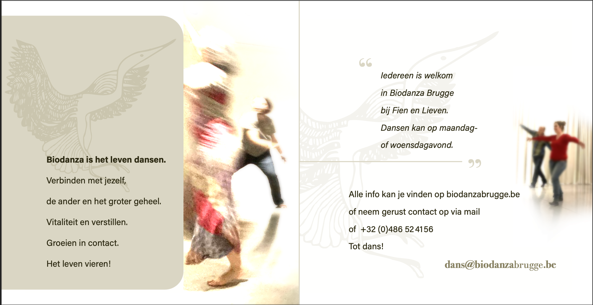

<table>
<tr>
<td width=66%>

</td>
<td width=34%>

</td>
</table>

 
Biodanza is een pad naar de vreugde in het leven  
en maakt gebruik van de kracht van  
muziek, dans en beweging in groep  
om tot een beleving (vivencia) te komen.  

In de wekelijkse Biodanza groep dansen we en verbinden we met onszelf, de anderen en het groter geheel.   
We doen dat in een veilige groep waar we open staan voor elkaar zonder oordeel.

Voel je het verlangen om te dansen en te bewegen vanuit jouw krachtige, speelse, gevoelige, nood-aan-verbindende zijn? Warm welkom!

Enkele getuigenissen vind je [hier](getuigenissen.html)

 

###  Nieuw!   Biodanza sessie met Fien op Bloom Fair in Dudzele op 18/2 

- Zin om Biodanza eens uit te proberen of een vivencia mee te pikken? Goed nieuws! 
- Ik geeft een sessie van 1u op Bloom Fair in Dudzele op 18/2! 
- Er is natuurlijk nog veel meer te beleven op deze dag! Warm welkom allemaal! 
- Ik bied jullie een kortingscode aanbieden van 10% Ticketing link.  [https://www.bloom.be/spirituele-beurzen](https://www.bloom.be/spirituele-beurzen)  Discountcode: BLOOMFAIR2024DISCOUNT  
Ik zie jullie graag… daar!  
Liefs, Fien

 

<!-- ### Nieuw! Zomerlessen op maandag met Fien & Lieven 

Zin om verder te dansen tijdens de zomer? Dat kan! 

- Maandag 03/07, 10/07 en 17/07 van 19u30 tot $\pm$ 21u15 
- €15/les met 3 of 10 beurtenkaart
- [Klik hier om in te schrijven](./inschrijvenZomerLessen.html)

De lessen staan voor iedereen open. 
Is Biodanza nieuw voor jou? Welkom om deel te nemen met een 3-beurtenkaart en te beleven wat Biodanza jou kan brengen.
Heb je al Biodanza-ervaring dan kan je zoals anders je 10-beurten kaart gebruiken. 

 
-->

### Integratiegroep op maandag met Fien & Lieven 

Benieuwd om Biodanza te ervaren? Je hebt helemaal geen bewegingservaring nodig of een lichaam die (nog) alles kan. De bewegingen, dans en houdingen komen van binnenuit. Enkel een hart die zich wenst te openen is de sleutel tot de Biodanza ervaring.  

- Maandag van 19u30 tot $\pm$ 21u15
<!--
- Herfst 2024: 02/10, 09/10, 16/10, 23/10, 06/11, 13/11, 20/11, 27/11, 04/12, 11/12, 18/12
-->
- Voorjaar 2024: 08/01, 15/01, 22/01, 29/01, 05/02, 19/02, 26/02, 04/03, 11/03, 18/03
- €15/les met 3 of 10 beurtenkaart
- [Klik hier om in te schrijven](./inschrijvenIntegratieGroep.html)

 

### Nieuw! Daggroep op dinsdag met Virginie 

- Dinsdag van 13u30 tot $\pm$ 15u30
<!-- 
- Ontdekkingsreeks (3 keer): 12/09, 19/09, 26/09 -- €40 
- Herfst 2023: 10/10, 17/10, 24/10, 7/11, 14/11, 21/11, 28/11, 05/12, 12/12, 19/12 
-->
- Voorjaar 2024:  09/01, 16/01, 23/01, 30/01, 6/02, 20/02, 27/02, 05/03, 12/03, 19/03 
- €15/les met 10 beurtenkaart 
- Ontdekkingreeks 3 opeenvolgende beurten €45

<!--
-->
- [Klik hier om in te schrijven](./inschrijvenVirginie.html)

 

### Verdiepingsgroep op woensdag met Fien & Lieven 

- Woensdag van 20u tot $\pm$ 21u45
<!-- 
- Herfst 2023: 13/09, 20/09, 27/09, 04/10, 11/10, 18/10, 25/10, 08/11, 15/11, 22/11, 29/11, 06/12, 13/12, 20/12
-->
- Voorjaar 2024: 10/01, 17/01, 24/01, 31/01, 07/02, 21/02, 28/02, 06/03, 13/03, 20/03, 27/03
- €15/les met 3 of 10 beurtenkaart
- Inschrijven na contact met Fien  ([info@n-zicht.be](mailto:info@n-zicht.be) of +32 486 52 41 56)

 

### Deelnemen

  - Virginie 
    - Ontdekkingsreeks -- 3 opeenvolgende lessen -- €45 
    - 10-beurtenkaart -- €150: geldig bij Virginie 

  

  - Fien & Lieven 
    - 10-beurtenkaart -- €150: geldig voor lessen in alle reeksen bij Fien & Lieven
    - 3-beurtenkaart -- €45: 3 opeenvolgende lessen bij Fien & Lieven
    - Instromen in de verdiepingsgroep kan als je al ervaring hebt met Biodanza. Neem je dan eerst even contact op met Fien? [info@n-zicht.be](mailto:info@n-zicht.be) of +32 486 52 41 56

 

### Waar? 

Centrum Xaverianen (Fien & Lieven),  
Polyvalente zaal A  
Xaverianenstraat 3,  
8200 Sint-Michiels

 

Co-housing Eikenberg (Virginie)    
Eikenberg 27/A         
8310 Sint-Kruis

  

### Wanneer? 

- Integratiegroep: maandag van 19u30u tot $\pm$ 21u15 (Fien & Lieven).

- Daggroep: dinsdag van 13u30 tot $\pm$ 15u30 (Virginie). 
- Verdiepingsgroep: woensdag van 20u tot $\pm$ 21u45 (Fien & Lieven).

 

### Wat heb je nodig? 

  - Een dekentje,
  - een flesje water, en
  - kledij waar je vrij in kan bewegen
  
 

### Inschrijven 

<!-- 
- Zomerlessen op maandag (Fien & Lieven): [klik hier om in te schrijven](./inschrijvenZomerLessen.html)
-->
- Integratiegroep op maandag (Fien & Lieven): [klik hier om in te schrijven](./inschrijvenIntegratieGroep.html)
- Daggroep op dinsdag (Virginie): [klik hier om in te schrijven](./inschrijvenVirginie.html)
- Verdiepingsgroep op woensdag (Fien & Lieven): na contact met Fien  ([info@n-zicht.be](mailto:info@n-zicht.be) of +32 486 52 41 56)

