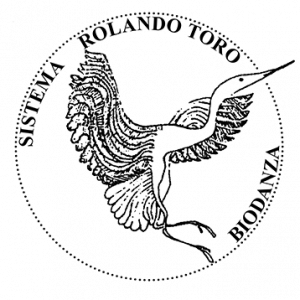

De driedaagse Identiteit en de Vier Elementen nodigt je uit tot persoonlijke ontwikkeling vanuit een holistische benadering. We dansen en beleven ons water, aarde, vuur, en lucht - verschillende kwaliteiten en energieën - die we allen in ons dragen. We verkennen deze krachten en krijgen de kans om geremde elementen te voeden en te ontwikkelen.   
 
Heerlijk om dan een groter evenwicht te ervaren, je zelfbewustzijn te voelen groeien en een diepere verbinding met jezelf en de wereld om je heen te ervaren.   

Benieuwd welke elementen sterk aanwezig zijn bij jou?   
Benieuwd welke elementen je nog meer kan voeden om zo jezelf te harmoniseren?   
Warm welkom om mee op ontdekkingstocht te gaan in deze boeiende wereld van de innerlijke alchemie!   

Je logeert all-in in een oase van groen en rust in het hartje van Gent.   
Daar nemen Fien & Lieven je met veel passie mee om de kracht van de vier elementen te ontdekken.   
Dat doen we via dans, beweging en muziek in een diep contact met jezelf, de anderen en het universum.   
 

### Praktisch

-	Wanneer: 29-31 mei 2025.  Van donderdag 10u tot zaterdag 17u
-	Verblijf: Het Rustpunt – Burgstraat 110-116, 9000 Gent
-	Investering: €450/pp bij overnachting in twee persoonskamer met badkamer (8 kamers met 2 aparte bedden, 2 kamers met dubbel bed beschikbaar)
-	€30 supplement voor overnachting in een 1-persoonskamer (2 kamers beschikbaar)
-	Inbegrepen: 6 vivencia’s, 2 overnachtingen met ontbijt (vrij-zat), 2 x lunch (vrij-zat), 2 x diner (do-vrij), doorlopend water, thee en koffie
-	Biodanza-gewijs potluck op donderdagmiddag. Breng iets lekkers mee om te eten waar we samen van kunnen genieten (geen oven of opwarm mogelijkheden)

{width=20%}

[<button type="attribute">IK SCHRIJF ME IN</button>](https://docs.google.com/forms/d/e/1FAIpQLScevr0Ww7FtogQq5zZfOPjmvRDnDH8I5aoy2u6fQDw9RdThCA/viewform?usp=sharing)
<!--
### Inschrijven

<iframe src="https://docs.google.com/forms/d/e/1FAIpQLScevr0Ww7FtogQq5zZfOPjmvRDnDH8I5aoy2u6fQDw9RdThCA/viewform?embedded=true" width="640" height="1663" frameborder="0" marginheight="0" marginwidth="0">Laden…</iframe>
-->